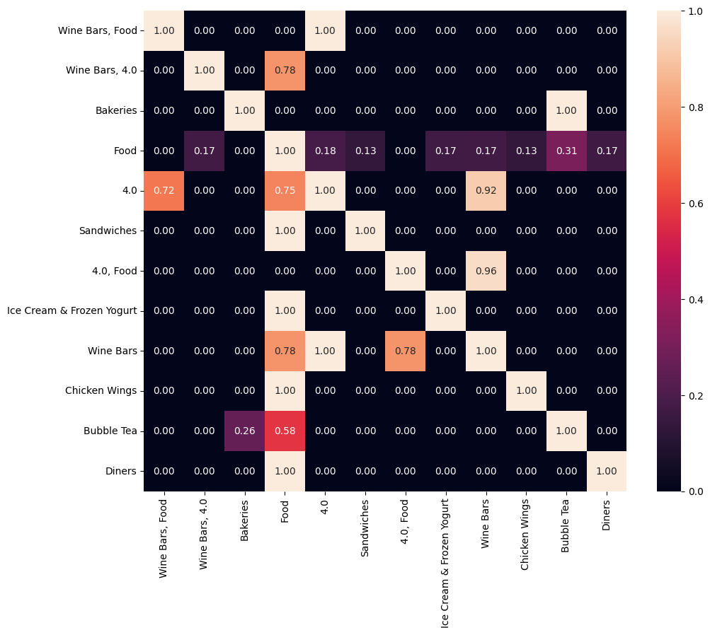
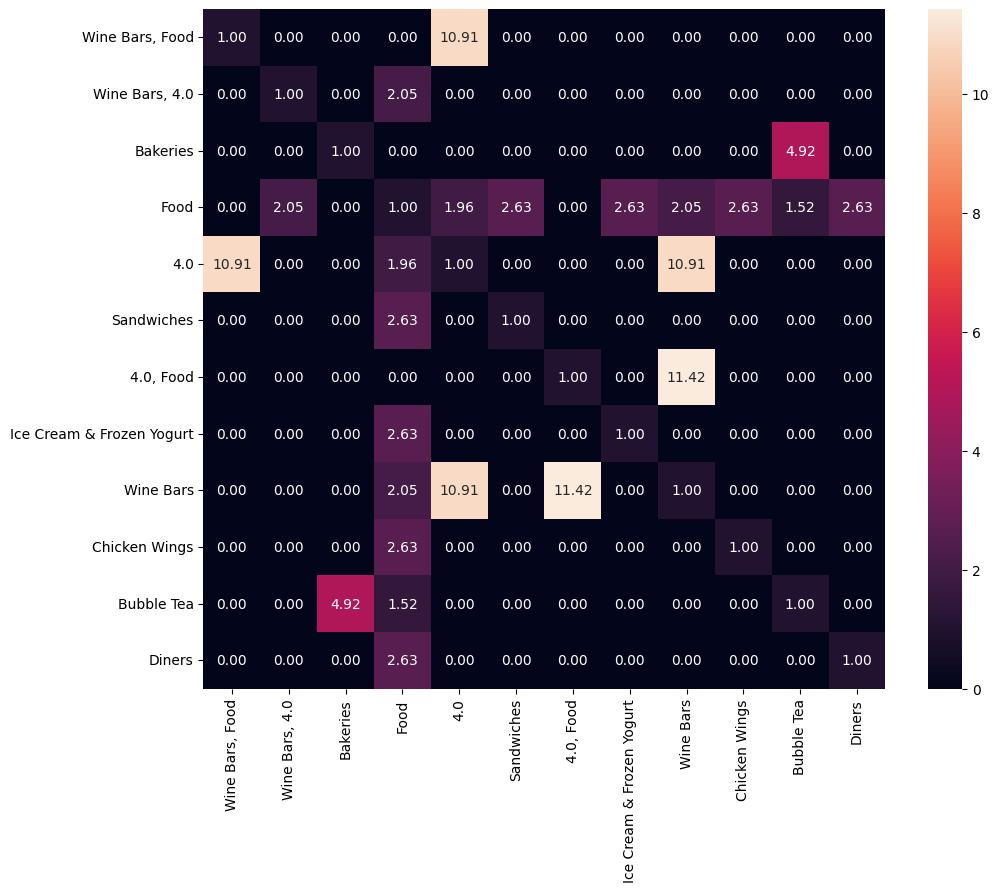
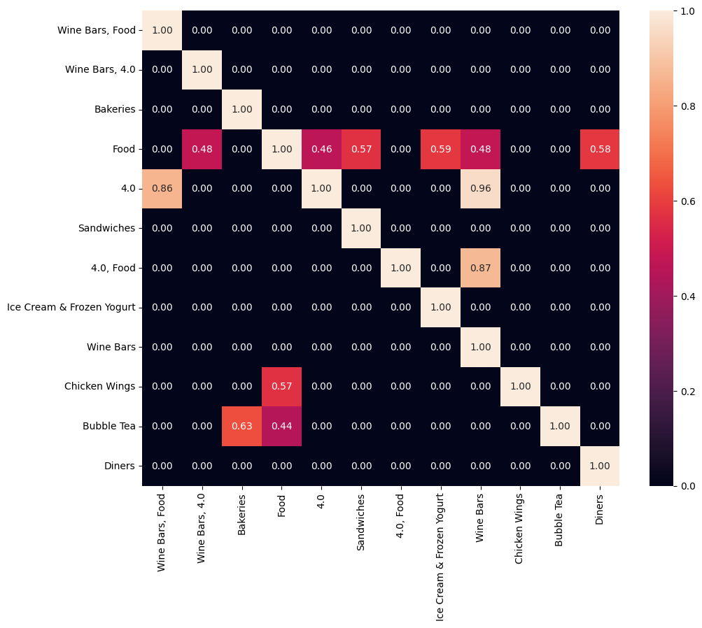

# 数据挖掘互评作业二: 频繁模式与关联规则挖掘
1. 问题描述
本次作业中，将选择2个数据集进行分析与挖掘


2. 可选数据集
来源包括：
SNAP(Stanford Large Network Dataset Collection): http://snap.stanford.edu/data/index.html
Microsoft 资讯推荐:  https://learn.microsoft.com/zh-cn/azure/open-datasets/dataset-microsoft-news?tabs=azureml-opendatasets
YELP: https://www.yelp.com/dataset/download
DBLP: https://dblp.uni-trier.de/xml/

3. 数据分析要求
数据获取与预处理；
频繁模式挖掘：可以是项集、序列和图。
模式命名：如论文-作者网络中合作模式、引用模式和发表模式等，不同的领域的频繁模式的含义也不尽相同，需自行确定模式的名称。
对挖掘结果进行分析；
可视化展示。

4. 提交的内容
数据集获取和预处理的代码
关联规则挖掘的代码
挖掘过程的报告：展示挖掘的过程、结果和你的分析
所选择的数据集在README中说明，数据文件不要上传到Github中

# 一、针对Microsoft资讯推荐数据集的处理

## 1、数据获取与预处理

### 数据获取
运行 https://learn.microsoft.com/zh-cn/azure/open-datasets/dataset-microsoft-news?tabs=azureml-opendatasets 给出的数据获取代码


```python
import os
import tempfile
import shutil
import urllib
import zipfile
import pandas as pd

# Temporary folder for data we need during execution of this notebook (we'll clean up
# at the end, we promise)
temp_dir = os.path.join(tempfile.gettempdir(), 'mind')
os.makedirs(temp_dir, exist_ok=True)

# The dataset is split into training and validation set, each with a large and small version.
# The format of the four files are the same.
# For demonstration purpose, we will use small version validation set only.
base_url = 'https://mind201910small.blob.core.windows.net/release'
training_small_url = f'{base_url}/MINDsmall_train.zip'
validation_small_url = f'{base_url}/MINDsmall_dev.zip'
training_large_url = f'{base_url}/MINDlarge_train.zip'
validation_large_url = f'{base_url}/MINDlarge_dev.zip'
```


```python
def download_url(url,
                 destination_filename=None,
                 progress_updater=None,
                 force_download=False,
                 verbose=True):
    """
    Download a URL to a temporary file
    """
    if not verbose:
        progress_updater = None
    # This is not intended to guarantee uniqueness, we just know it happens to guarantee
    # uniqueness for this application.
    if destination_filename is None:
        url_as_filename = url.replace('://', '_').replace('/', '_')
        destination_filename = \
            os.path.join(temp_dir,url_as_filename)
    if (not force_download) and (os.path.isfile(destination_filename)):
        if verbose:
            print('Bypassing download of already-downloaded file {}'.format(
                os.path.basename(url)))
        return destination_filename
    if verbose:
        print('Downloading file {} to {}'.format(os.path.basename(url),
                                                 destination_filename),
              end='')
    urllib.request.urlretrieve(url, destination_filename, progress_updater)
    assert (os.path.isfile(destination_filename))
    nBytes = os.path.getsize(destination_filename)
    if verbose:
        print('...done, {} bytes.'.format(nBytes))
    return destination_filename
```


```python
# For demonstration purpose, we will use small version validation set only.
# This file is about 30MB.
zip_path = download_url(validation_small_url, verbose=True)
with zipfile.ZipFile(zip_path, 'r') as zip_ref:
    zip_ref.extractall(temp_dir)

os.listdir(temp_dir)
```

    Bypassing download of already-downloaded file MINDsmall_dev.zip
    


    ['behaviors.tsv',
     'entity_embedding.vec',
     'https_mind201910small.blob.core.windows.net_release_MINDsmall_dev.zip',
     'news.tsv',
     'relation_embedding.vec']


```python
# The behaviors.tsv file contains the impression logs and users' news click histories. 
# It has 5 columns divided by the tab symbol:
# - Impression ID. The ID of an impression.
# - User ID. The anonymous ID of a user.
# - Time. The impression time with format "MM/DD/YYYY HH:MM:SS AM/PM".
# - History. The news click history (ID list of clicked news) of this user before this impression.
# - Impressions. List of news displayed in this impression and user's click behaviors on them (1 for click and 0 for non-click).
behaviors_path = os.path.join(temp_dir, 'behaviors.tsv')
behaviors_table = pd.read_table(
    behaviors_path,
    header=None,
    names=['impression_id', 'user_id', 'time', 'history', 'impressions'])
behaviors_table
```


<div>
<style scoped>
    .dataframe tbody tr th:only-of-type {
        vertical-align: middle;
    }

    .dataframe tbody tr th {
        vertical-align: top;
    }

    .dataframe thead th {
        text-align: right;
    }
</style>
<table border="1" class="dataframe">
  <thead>
    <tr style="text-align: right;">
      <th></th>
      <th>impression_id</th>
      <th>user_id</th>
      <th>time</th>
      <th>history</th>
      <th>impressions</th>
    </tr>
  </thead>
  <tbody>
    <tr>
      <th>0</th>
      <td>1</td>
      <td>U80234</td>
      <td>11/15/2019 12:37:50 PM</td>
      <td>N55189 N46039 N51741 N53234 N11276 N264 N40716...</td>
      <td>N28682-0 N48740-0 N31958-1 N34130-0 N6916-0 N5...</td>
    </tr>
    <tr>
      <th>1</th>
      <td>2</td>
      <td>U60458</td>
      <td>11/15/2019 7:11:50 AM</td>
      <td>N58715 N32109 N51180 N33438 N54827 N28488 N611...</td>
      <td>N20036-0 N23513-1 N32536-0 N46976-0 N35216-0 N...</td>
    </tr>
    <tr>
      <th>2</th>
      <td>3</td>
      <td>U44190</td>
      <td>11/15/2019 9:55:12 AM</td>
      <td>N56253 N1150 N55189 N16233 N61704 N51706 N5303...</td>
      <td>N36779-0 N62365-0 N58098-0 N5472-0 N13408-0 N5...</td>
    </tr>
    <tr>
      <th>3</th>
      <td>4</td>
      <td>U87380</td>
      <td>11/15/2019 3:12:46 PM</td>
      <td>N63554 N49153 N28678 N23232 N43369 N58518 N444...</td>
      <td>N6950-0 N60215-0 N6074-0 N11930-0 N6916-0 N248...</td>
    </tr>
    <tr>
      <th>4</th>
      <td>5</td>
      <td>U9444</td>
      <td>11/15/2019 8:25:46 AM</td>
      <td>N51692 N18285 N26015 N22679 N55556</td>
      <td>N5940-1 N23513-0 N49285-0 N23355-0 N19990-0 N3...</td>
    </tr>
    <tr>
      <th>...</th>
      <td>...</td>
      <td>...</td>
      <td>...</td>
      <td>...</td>
      <td>...</td>
    </tr>
    <tr>
      <th>73147</th>
      <td>73148</td>
      <td>U77536</td>
      <td>11/15/2019 8:40:16 PM</td>
      <td>N28691 N8845 N58434 N37120 N22185 N60033 N4702...</td>
      <td>N496-0 N35159-0 N59856-0 N13270-0 N47213-0 N26...</td>
    </tr>
    <tr>
      <th>73148</th>
      <td>73149</td>
      <td>U56193</td>
      <td>11/15/2019 1:11:26 PM</td>
      <td>N4705 N58782 N53531 N46492 N26026 N28088 N3109...</td>
      <td>N49285-0 N31958-0 N55237-0 N42844-0 N29862-0 N...</td>
    </tr>
    <tr>
      <th>73149</th>
      <td>73150</td>
      <td>U16799</td>
      <td>11/15/2019 3:37:06 PM</td>
      <td>N40826 N42078 N15670 N15295 N64536 N46845 N52294</td>
      <td>N7043-0 N512-0 N60215-1 N45057-0 N496-0 N37055...</td>
    </tr>
    <tr>
      <th>73150</th>
      <td>73151</td>
      <td>U8786</td>
      <td>11/15/2019 8:29:26 AM</td>
      <td>N3046 N356 N20483 N46107 N44598 N18693 N8254 N...</td>
      <td>N23692-0 N19990-0 N20187-0 N5940-0 N13408-0 N3...</td>
    </tr>
    <tr>
      <th>73151</th>
      <td>73152</td>
      <td>U68182</td>
      <td>11/15/2019 11:54:34 AM</td>
      <td>N20297 N53568 N4690 N60608 N43709 N43123 N1885...</td>
      <td>N29862-0 N5472-0 N21679-1 N6400-0 N53572-0 N50...</td>
    </tr>
  </tbody>
</table>
<p>73152 rows × 5 columns</p>
</div>


```python
# The news.tsv file contains the detailed information of news articles involved in the behaviors.tsv file.
# It has 7 columns, which are divided by the tab symbol:
# - News ID
# - Category
# - Subcategory
# - Title
# - Abstract
# - URL
# - Title Entities (entities contained in the title of this news)
# - Abstract Entities (entities contained in the abstract of this news)
news_path = os.path.join(temp_dir, 'news.tsv')
news_table = pd.read_table(news_path,
              header=None,
              names=[
                  'id', 'category', 'subcategory', 'title', 'abstract', 'url',
                  'title_entities', 'abstract_entities'
              ])
news_table
```


<div>
<style scoped>
    .dataframe tbody tr th:only-of-type {
        vertical-align: middle;
    }

    .dataframe tbody tr th {
        vertical-align: top;
    }

    .dataframe thead th {
        text-align: right;
    }
</style>
<table border="1" class="dataframe">
  <thead>
    <tr style="text-align: right;">
      <th></th>
      <th>id</th>
      <th>category</th>
      <th>subcategory</th>
      <th>title</th>
      <th>abstract</th>
      <th>url</th>
      <th>title_entities</th>
      <th>abstract_entities</th>
    </tr>
  </thead>
  <tbody>
    <tr>
      <th>0</th>
      <td>N55528</td>
      <td>lifestyle</td>
      <td>lifestyleroyals</td>
      <td>The Brands Queen Elizabeth, Prince Charles, an...</td>
      <td>Shop the notebooks, jackets, and more that the...</td>
      <td>https://assets.msn.com/labs/mind/AAGH0ET.html</td>
      <td>[{"Label": "Prince Philip, Duke of Edinburgh",...</td>
      <td>[]</td>
    </tr>
    <tr>
      <th>1</th>
      <td>N18955</td>
      <td>health</td>
      <td>medical</td>
      <td>Dispose of unwanted prescription drugs during ...</td>
      <td>NaN</td>
      <td>https://assets.msn.com/labs/mind/AAISxPN.html</td>
      <td>[{"Label": "Drug Enforcement Administration", ...</td>
      <td>[]</td>
    </tr>
    <tr>
      <th>2</th>
      <td>N61837</td>
      <td>news</td>
      <td>newsworld</td>
      <td>The Cost of Trump's Aid Freeze in the Trenches...</td>
      <td>Lt. Ivan Molchanets peeked over a parapet of s...</td>
      <td>https://assets.msn.com/labs/mind/AAJgNsz.html</td>
      <td>[]</td>
      <td>[{"Label": "Ukraine", "Type": "G", "WikidataId...</td>
    </tr>
    <tr>
      <th>3</th>
      <td>N53526</td>
      <td>health</td>
      <td>voices</td>
      <td>I Was An NBA Wife. Here's How It Affected My M...</td>
      <td>I felt like I was a fraud, and being an NBA wi...</td>
      <td>https://assets.msn.com/labs/mind/AACk2N6.html</td>
      <td>[]</td>
      <td>[{"Label": "National Basketball Association", ...</td>
    </tr>
    <tr>
      <th>4</th>
      <td>N38324</td>
      <td>health</td>
      <td>medical</td>
      <td>How to Get Rid of Skin Tags, According to a De...</td>
      <td>They seem harmless, but there's a very good re...</td>
      <td>https://assets.msn.com/labs/mind/AAAKEkt.html</td>
      <td>[{"Label": "Skin tag", "Type": "C", "WikidataI...</td>
      <td>[{"Label": "Skin tag", "Type": "C", "WikidataI...</td>
    </tr>
    <tr>
      <th>...</th>
      <td>...</td>
      <td>...</td>
      <td>...</td>
      <td>...</td>
      <td>...</td>
      <td>...</td>
      <td>...</td>
      <td>...</td>
    </tr>
    <tr>
      <th>42411</th>
      <td>N63550</td>
      <td>lifestyle</td>
      <td>lifestyleroyals</td>
      <td>Why Kate &amp; Meghan Were on Different Balconies ...</td>
      <td>There's no scandal here. It's all about the or...</td>
      <td>https://assets.msn.com/labs/mind/BBWyynu.html</td>
      <td>[{"Label": "Meghan, Duchess of Sussex", "Type"...</td>
      <td>[]</td>
    </tr>
    <tr>
      <th>42412</th>
      <td>N30345</td>
      <td>entertainment</td>
      <td>entertainment-celebrity</td>
      <td>See the stars at the 2019 Baby2Baby gala</td>
      <td>Stars like Chrissy Teigen and Kate Hudson supp...</td>
      <td>https://assets.msn.com/labs/mind/BBWyz7N.html</td>
      <td>[]</td>
      <td>[{"Label": "Kate Hudson", "Type": "P", "Wikida...</td>
    </tr>
    <tr>
      <th>42413</th>
      <td>N30135</td>
      <td>news</td>
      <td>newsgoodnews</td>
      <td>Tennessee judge holds lawyer's baby as he swea...</td>
      <td>Tennessee Court of Appeals Judge Richard Dinki...</td>
      <td>https://assets.msn.com/labs/mind/BBWyzI8.html</td>
      <td>[{"Label": "Tennessee", "Type": "G", "Wikidata...</td>
      <td>[{"Label": "Tennessee Court of Appeals", "Type...</td>
    </tr>
    <tr>
      <th>42414</th>
      <td>N44276</td>
      <td>autos</td>
      <td>autossports</td>
      <td>Best Sports Car Deals for October</td>
      <td>NaN</td>
      <td>https://assets.msn.com/labs/mind/BBy5rVe.html</td>
      <td>[{"Label": "Peugeot RCZ", "Type": "V", "Wikida...</td>
      <td>[]</td>
    </tr>
    <tr>
      <th>42415</th>
      <td>N39563</td>
      <td>sports</td>
      <td>more_sports</td>
      <td>Shall we dance: Sports stars shake their leg</td>
      <td>NaN</td>
      <td>https://assets.msn.com/labs/mind/BBzMpnG.html</td>
      <td>[]</td>
      <td>[]</td>
    </tr>
  </tbody>
</table>
<p>42416 rows × 8 columns</p>
</div>


```python
# The entity_embedding.vec file contains the 100-dimensional embeddings
# of the entities learned from the subgraph by TransE method.
# The first column is the ID of entity, and the other columns are the embedding vector values.
entity_embedding_path = os.path.join(temp_dir, 'entity_embedding.vec')
entity_embedding = pd.read_table(entity_embedding_path, header=None)
entity_embedding['vector'] = entity_embedding.iloc[:, 1:101].values.tolist()
entity_embedding = entity_embedding[[0,
                                     'vector']].rename(columns={0: "entity"})
entity_embedding
```


<div>
<style scoped>
    .dataframe tbody tr th:only-of-type {
        vertical-align: middle;
    }

    .dataframe tbody tr th {
        vertical-align: top;
    }

    .dataframe thead th {
        text-align: right;
    }
</style>
<table border="1" class="dataframe">
  <thead>
    <tr style="text-align: right;">
      <th></th>
      <th>entity</th>
      <th>vector</th>
    </tr>
  </thead>
  <tbody>
    <tr>
      <th>0</th>
      <td>Q34433</td>
      <td>[0.017808, -0.073256, 0.102521, -0.059926, -0....</td>
    </tr>
    <tr>
      <th>1</th>
      <td>Q41</td>
      <td>[-0.063388, -0.181451, 0.057501, -0.091254, -0...</td>
    </tr>
    <tr>
      <th>2</th>
      <td>Q56037</td>
      <td>[0.02155, -0.044888, -0.027872, -0.128843, 0.0...</td>
    </tr>
    <tr>
      <th>3</th>
      <td>Q1860</td>
      <td>[0.060958, 0.069934, 0.015832, 0.079471, -0.02...</td>
    </tr>
    <tr>
      <th>4</th>
      <td>Q39631</td>
      <td>[-0.093106, -0.052002, 0.020556, -0.020801, 0....</td>
    </tr>
    <tr>
      <th>...</th>
      <td>...</td>
      <td>...</td>
    </tr>
    <tr>
      <th>22888</th>
      <td>Q278846</td>
      <td>[0.042413, 0.021957, 0.072414, -0.068437, 0.02...</td>
    </tr>
    <tr>
      <th>22889</th>
      <td>Q54621949</td>
      <td>[-0.018299, -0.048378, -0.021645, -0.079743, 0...</td>
    </tr>
    <tr>
      <th>22890</th>
      <td>Q42225228</td>
      <td>[-0.051346, -0.028947, -0.07587, 0.017512, -0....</td>
    </tr>
    <tr>
      <th>22891</th>
      <td>Q54862508</td>
      <td>[-0.052323, -0.078029, -0.060925, -0.052536, 0...</td>
    </tr>
    <tr>
      <th>22892</th>
      <td>Q42301562</td>
      <td>[-0.00519, -0.047871, 0.009753, -0.0215, -4.9e...</td>
    </tr>
  </tbody>
</table>
<p>22893 rows × 2 columns</p>
</div>


```python
# The relation_embedding.vec file contains the 100-dimensional embeddings
# of the relations learned from the subgraph by TransE method.
# The first column is the ID of relation, and the other columns are the embedding vector values.
relation_embedding_path = os.path.join(temp_dir, 'relation_embedding.vec')
relation_embedding = pd.read_table(relation_embedding_path, header=None)
relation_embedding['vector'] = relation_embedding.iloc[:,
                                                       1:101].values.tolist()
relation_embedding = relation_embedding[[0, 'vector'
                                         ]].rename(columns={0: "relation"})
relation_embedding
```


<div>
<style scoped>
    .dataframe tbody tr th:only-of-type {
        vertical-align: middle;
    }

    .dataframe tbody tr th {
        vertical-align: top;
    }

    .dataframe thead th {
        text-align: right;
    }
</style>
<table border="1" class="dataframe">
  <thead>
    <tr style="text-align: right;">
      <th></th>
      <th>relation</th>
      <th>vector</th>
    </tr>
  </thead>
  <tbody>
    <tr>
      <th>0</th>
      <td>P31</td>
      <td>[-0.073467, -0.132227, 0.034173, -0.032769, 0....</td>
    </tr>
    <tr>
      <th>1</th>
      <td>P21</td>
      <td>[-0.078436, 0.108589, -0.049429, -0.131355, 0....</td>
    </tr>
    <tr>
      <th>2</th>
      <td>P106</td>
      <td>[-0.052137, 0.052444, -0.019886, -0.152309, 0....</td>
    </tr>
    <tr>
      <th>3</th>
      <td>P735</td>
      <td>[-0.051398, 0.056219, 0.068029, -0.137717, -0....</td>
    </tr>
    <tr>
      <th>4</th>
      <td>P108</td>
      <td>[0.091231, 0.022526, 0.059349, -0.141853, 0.03...</td>
    </tr>
    <tr>
      <th>...</th>
      <td>...</td>
      <td>...</td>
    </tr>
    <tr>
      <th>1086</th>
      <td>P1897</td>
      <td>[-0.019021, 0.001183, -0.009602, -0.040833, -0...</td>
    </tr>
    <tr>
      <th>1087</th>
      <td>P3776</td>
      <td>[-0.018365, 0.028526, -0.025934, 0.032296, -0....</td>
    </tr>
    <tr>
      <th>1088</th>
      <td>P1194</td>
      <td>[-0.026819, 0.003231, -0.011298, -0.015206, 0....</td>
    </tr>
    <tr>
      <th>1089</th>
      <td>P2502</td>
      <td>[0.003554, -0.041121, -0.010559, -0.037862, -0...</td>
    </tr>
    <tr>
      <th>1090</th>
      <td>P6977</td>
      <td>[-0.023617, -0.021648, 0.009369, -0.021757, 0....</td>
    </tr>
  </tbody>
</table>
<p>1091 rows × 2 columns</p>
</div>


### 数据预处理
将behaviors_table中的history按news_table中的类型替换为整数格式


```python
behaviors_table = behaviors_table.dropna()
transaction = []
category = news_table['category'].unique().tolist()
print(category)
err_num = 0
for i in range(len(behaviors_table)):
    if i%1000 == 0:
        print(i,'/',len(behaviors_table))
# for i in range(10):
    try:
        news_list = behaviors_table['history'][i].split(' ')
        tmp_list = []
        for news_id in news_list:
            tmp_list.append(category.index(news_table['category'][news_table[news_table.id == news_id].index.tolist()[0]]))
        transaction.append(tmp_list)
    except:
        err_num += 1
print('error count: ', err_num)
print(transaction[0:10])
```

    ['lifestyle', 'health', 'news', 'sports', 'weather', 'entertainment', 'foodanddrink', 'autos', 'travel', 'video', 'tv', 'finance', 'movies', 'music', 'kids', 'middleeast', 'games']
    0 / 70938
    1000 / 70938
    2000 / 70938
    3000 / 70938
    4000 / 70938
    5000 / 70938
    6000 / 70938
    7000 / 70938
    8000 / 70938
    9000 / 70938
    10000 / 70938
    11000 / 70938
    12000 / 70938
    13000 / 70938
    14000 / 70938
    15000 / 70938
    16000 / 70938
    17000 / 70938
    18000 / 70938
    19000 / 70938
    20000 / 70938
    21000 / 70938
    22000 / 70938
    23000 / 70938
    24000 / 70938
    25000 / 70938
    26000 / 70938
    27000 / 70938
    28000 / 70938
    29000 / 70938
    30000 / 70938
    31000 / 70938
    32000 / 70938
    33000 / 70938
    34000 / 70938
    35000 / 70938
    36000 / 70938
    37000 / 70938
    38000 / 70938
    39000 / 70938
    40000 / 70938
    41000 / 70938
    42000 / 70938
    43000 / 70938
    44000 / 70938
    45000 / 70938
    46000 / 70938
    47000 / 70938
    48000 / 70938
    49000 / 70938
    50000 / 70938
    51000 / 70938
    52000 / 70938
    53000 / 70938
    54000 / 70938
    55000 / 70938
    56000 / 70938
    57000 / 70938
    58000 / 70938
    59000 / 70938
    60000 / 70938
    61000 / 70938
    62000 / 70938
    63000 / 70938
    64000 / 70938
    65000 / 70938
    66000 / 70938
    67000 / 70938
    68000 / 70938
    69000 / 70938
    70000 / 70938
    error count:  2150
    [[10, 2, 10, 2, 11, 7, 10, 12, 5, 2, 0, 2, 2, 1, 10], [2, 8, 11, 2, 2, 11, 13, 2, 11, 4, 11, 1, 0], [3, 2, 10, 2, 0, 3, 2, 5, 3], [8, 2, 3, 3, 8, 2, 10, 2, 3, 2, 10, 2, 12, 8, 9, 2, 3, 3, 2], [10, 3, 5, 3, 11], [3, 11, 3, 2, 2, 11, 6, 5, 3, 11, 7], [10, 10, 2, 6, 11, 2, 11, 0, 6], [2, 3, 2, 2, 3, 3, 3, 2, 3, 2], [2, 3, 2, 2, 2, 2, 5, 2, 2], [2, 3, 11, 2, 2, 2, 2, 2, 1, 12]]
    

## 2、频繁模式与关联规则挖掘

使用orangecontrib.associate.fpgrowth包进行频繁模式挖掘。首先使用默认的0.2作为频繁模式的相对支持度支持度阈值。


```python
import orangecontrib.associate.fpgrowth as oaf

items = list(oaf.frequent_itemsets(transaction, 0.5))
for i in items:
    print(i)
```

    (frozenset({0}), 49167)
    (frozenset({2}), 61406)
    (frozenset({0, 2}), 45533)
    (frozenset({3}), 47444)
    (frozenset({0, 3}), 35535)
    (frozenset({2, 3}), 43907)
    (frozenset({10}), 45719)
    (frozenset({0, 10}), 36972)
    (frozenset({2, 10}), 42526)
    (frozenset({0, 2, 10}), 35192)
    (frozenset({11}), 42614)
    (frozenset({2, 11}), 40412)
    

frozenset是项集，后面的数字是这个项集的绝对支持度。为了更好地显示频繁项集，下面将数字重新转化为原始的字符串，同时计算相对支持度。


```python
for i in items:
    freq_set = []
    abs_sup = i[1]
    for j in i[0]:
        freq_set.append(category[j])
    print(freq_set, abs_sup, round(float(abs_sup) / len(behaviors_table), 2))
```

    ['lifestyle'] 49167 0.69
    ['news'] 61406 0.87
    ['lifestyle', 'news'] 45533 0.64
    ['sports'] 47444 0.67
    ['lifestyle', 'sports'] 35535 0.5
    ['news', 'sports'] 43907 0.62
    ['tv'] 45719 0.64
    ['lifestyle', 'tv'] 36972 0.52
    ['news', 'tv'] 42526 0.6
    ['lifestyle', 'news', 'tv'] 35192 0.5
    ['finance'] 42614 0.6
    ['news', 'finance'] 40412 0.57
    

在计算出频繁项集的基础上，计算关联规则，置信度阈值选择为0.5，结果转化为原始字符串输出.


```python
items = list(oaf.frequent_itemsets(transaction, 0.5))
rules = list(oaf.association_rules(dict(items), 0.5))
for i in rules:
    antecedent = []
    consequent = []
    for j in i[0]:
        antecedent.append(category[j])
    for j in i[1]:
        consequent.append(category[j])
    print(antecedent, "->", consequent, i[2], round(i[3],2))
print(len(rules))
```

    ['news', 'tv'] -> ['lifestyle'] 35192 0.83
    ['lifestyle', 'tv'] -> ['news'] 35192 0.95
    ['tv'] -> ['lifestyle', 'news'] 35192 0.77
    ['lifestyle', 'news'] -> ['tv'] 35192 0.77
    ['news'] -> ['lifestyle', 'tv'] 35192 0.57
    ['lifestyle'] -> ['tv', 'news'] 35192 0.72
    ['news'] -> ['lifestyle'] 45533 0.74
    ['lifestyle'] -> ['news'] 45533 0.93
    ['sports'] -> ['lifestyle'] 35535 0.75
    ['lifestyle'] -> ['sports'] 35535 0.72
    ['sports'] -> ['news'] 43907 0.93
    ['news'] -> ['sports'] 43907 0.72
    ['tv'] -> ['lifestyle'] 36972 0.81
    ['lifestyle'] -> ['tv'] 36972 0.75
    ['tv'] -> ['news'] 42526 0.93
    ['news'] -> ['tv'] 42526 0.69
    ['finance'] -> ['news'] 40412 0.95
    ['news'] -> ['finance'] 40412 0.66
    18
    

## 3.关联规则的评价

使用Lift和Kulc两种评价指标评价关联规则。


```python
measure = list(oaf.rules_stats(oaf.association_rules(dict(items), 0.5), dict(oaf.frequent_itemsets(transaction, 0.5)), len(behaviors_table)))
for i in measure:
    antecedent = []
    consequent = []
    for j in i[0]:
        antecedent.append(category[j])
    for j in i[1]:
        consequent.append(category[j])
    print(antecedent, "->", consequent, round(i[6], 2))
```

    ['news', 'tv'] -> ['lifestyle'] 1.19
    ['lifestyle', 'tv'] -> ['news'] 1.1
    ['tv'] -> ['lifestyle', 'news'] 1.2
    ['lifestyle', 'news'] -> ['tv'] 1.2
    ['news'] -> ['lifestyle', 'tv'] 1.1
    ['lifestyle'] -> ['tv', 'news'] 1.19
    ['news'] -> ['lifestyle'] 1.07
    ['lifestyle'] -> ['news'] 1.07
    ['sports'] -> ['lifestyle'] 1.08
    ['lifestyle'] -> ['sports'] 1.08
    ['sports'] -> ['news'] 1.07
    ['news'] -> ['sports'] 1.07
    ['tv'] -> ['lifestyle'] 1.17
    ['lifestyle'] -> ['tv'] 1.17
    ['tv'] -> ['news'] 1.07
    ['news'] -> ['tv'] 1.07
    ['finance'] -> ['news'] 1.1
    ['news'] -> ['finance'] 1.1
    


```python
# 计算Kulc
kulc = []
visit = [False for i in range(len(rules))]
for i in range(len(rules)):
    if visit[i] == True:
        continue
    visit[i] = True
    for j in range(len(rules)):
        if visit[j] == True:
            continue
        if rules[j][0] == rules[i][1] and rules[j][1] == rules[i][0]:
            one = []
            antecedent = []
            consequent = []
            for k in rules[i][0]:
                antecedent.append(category[k])
            for k in rules[i][1]:
                consequent.append(category[k])
            one.append(rules[i][0])
            one.append(rules[i][1])
            one.append((rules[i][3] + rules[j][3])/2)
            kulc.append(one)
            print('Kulc(', antecedent, consequent, ') = ', round((rules[i][3] + rules[j][3])/2, 2))
            visit[j] = True
```

    Kulc( ['news', 'tv'] ['lifestyle'] ) =  0.77
    Kulc( ['lifestyle', 'tv'] ['news'] ) =  0.76
    Kulc( ['tv'] ['lifestyle', 'news'] ) =  0.77
    Kulc( ['news'] ['lifestyle'] ) =  0.83
    Kulc( ['sports'] ['lifestyle'] ) =  0.74
    Kulc( ['sports'] ['news'] ) =  0.82
    Kulc( ['tv'] ['lifestyle'] ) =  0.78
    Kulc( ['tv'] ['news'] ) =  0.81
    Kulc( ['finance'] ['news'] ) =  0.8
    

## 4.挖掘结果的分析

lift可以用于衡量关联规则中两个项目的相关度，
lift(A,B)>1说明A与B正相关，
lift(A,B)=1说明A与B相互独立，
lift(A,B)<1说明A与B负相关。所有的18条关联规则中，lift值均大于1。

在所有计算出的关联规则的Kulc值中，以下三个Kulc值较大：

Kulc( ['news'] ['lifestyle'] ) =  0.83

Kulc( ['sports'] ['news'] ) =  0.82

Kulc( ['tv'] ['news'] ) =  0.81

因此可以得到以下结论：

1、对新闻相关内容感兴趣的观众对生活方式相关内容同样感兴趣

2、对体育相关内容感兴趣的观众对新闻相关内容同样感兴趣

3、对电视节目相关内容感兴趣的观众对新闻相关内容同样感兴趣

在关联规则中，有两条的置信度很高：

['lifestyle', 'tv'] -> ['news'] 35192 0.95

['finance'] -> ['news'] 40412 0.95

## 5.可视化展示

绘制关联规则的置信度、Lift和Kulc相关性热图

横纵坐标是关联规则中包含的项，热图中每个点的数据是两项的置信度、Lift值或Kulc值


```python
import matplotlib.pyplot as plt
import seaborn as sns
# 利用置信度绘制热图
conf_matrix = []
rules_column = set()

for i in range(len(measure)):
    rules_column.add(measure[i][0])
# 计算置信度矩阵
for i in rules_column:
    one = []
    for j in rules_column:
        if i == j:
            one.append(1)
        else:
            flag = False
            for k in range(len(rules)):
                if rules[k][0] == i and rules[k][1] == j:
                    one.append(rules[k][3])
                    flag = True
            if flag == False:
                one.append(0)
    conf_matrix.append(one)
# 改columns名字
rules_column_list = []
for i in rules_column:
    one = ""
    for j in range(len(i)):
        one += category[j]
        if j < len(i) - 1:
            one += ", "
    rules_column_list.append(one)
# 绘制热图的数据
rules_column = list(rules_column)
rules_column_list = []
for i in rules_column:
    one = ""
    for j in range(len(i)):
        one += category[list(i)[j]]
        if j < len(i) - 1:
            one += ", "
    rules_column_list.append(one)

conf_pd = pd.DataFrame(conf_matrix, columns = rules_column_list, index = rules_column_list)
plt.figure(figsize=(11, 9),dpi=100)
sns.heatmap(data = conf_pd, annot = True, fmt = ".2f")
plt.show()
```


    

    


```python
# 使用Lift值绘制热图
# 计算lift矩阵
lift_matrix = []
for i in rules_column:
    one = []
    for j in rules_column:
        if i == j:
            one.append(1)
        else:
            flag = False
            for k in range(len(measure)):
                if measure[k][0] == i and measure[k][1] == j:
                    one.append(measure[k][6])
                    flag = True
            if flag == False:
                one.append(0)
    lift_matrix.append(one)

lift_pd = pd.DataFrame(lift_matrix, columns = rules_column_list, index = rules_column_list)
plt.figure(figsize=(11, 9),dpi=100)
sns.heatmap(data = lift_pd, annot = True, fmt = ".2f")
plt.show()
```


    

    


```python
# 使用Kulc值绘制热图
kulc_matrix = []
# 计算kulc矩阵
for i in rules_column:
    one = []
    for j in rules_column:
        if i == j:
            one.append(1)
        else:
            flag = False
            for k in range(len(kulc)):
                if kulc[k][0] == i and kulc[k][1] == j:
                    one.append(kulc[k][2])
                    flag = True
            if flag == False:
                one.append(0)
    kulc_matrix.append(one)
    
kulc_pd = pd.DataFrame(kulc_matrix, columns = rules_column_list, index = rules_column_list)
plt.figure(figsize=(11, 9),dpi=100)
sns.heatmap(data = kulc_pd, annot = True, fmt = ".2f")
plt.show()
```


    

    


# 二、针对YELP数据集的处理

## 1、数据获取与预处理


```python
# import json
# file = open("yelp_academic_dataset_business.json", 'r', encoding='utf-8')
# papers = []
# for line in file.readlines():
#     dic = json.loads(line)
#     papers.append(dic)


# print(len(papers))
# print(papers[0])
# print(papers[1])

import pandas as pd

df = pd.read_json('yelp_academic_dataset_business.json',lines=True)

df
```


<div>
<style scoped>
    .dataframe tbody tr th:only-of-type {
        vertical-align: middle;
    }

    .dataframe tbody tr th {
        vertical-align: top;
    }

    .dataframe thead th {
        text-align: right;
    }
</style>
<table border="1" class="dataframe">
  <thead>
    <tr style="text-align: right;">
      <th></th>
      <th>business_id</th>
      <th>name</th>
      <th>address</th>
      <th>city</th>
      <th>state</th>
      <th>postal_code</th>
      <th>latitude</th>
      <th>longitude</th>
      <th>stars</th>
      <th>review_count</th>
      <th>is_open</th>
      <th>attributes</th>
      <th>categories</th>
      <th>hours</th>
    </tr>
  </thead>
  <tbody>
    <tr>
      <th>0</th>
      <td>Pns2l4eNsfO8kk83dixA6A</td>
      <td>Abby Rappoport, LAC, CMQ</td>
      <td>1616 Chapala St, Ste 2</td>
      <td>Santa Barbara</td>
      <td>CA</td>
      <td>93101</td>
      <td>34.426679</td>
      <td>-119.711197</td>
      <td>5.0</td>
      <td>7</td>
      <td>0</td>
      <td>{'ByAppointmentOnly': 'True'}</td>
      <td>Doctors, Traditional Chinese Medicine, Naturop...</td>
      <td>None</td>
    </tr>
    <tr>
      <th>1</th>
      <td>mpf3x-BjTdTEA3yCZrAYPw</td>
      <td>The UPS Store</td>
      <td>87 Grasso Plaza Shopping Center</td>
      <td>Affton</td>
      <td>MO</td>
      <td>63123</td>
      <td>38.551126</td>
      <td>-90.335695</td>
      <td>3.0</td>
      <td>15</td>
      <td>1</td>
      <td>{'BusinessAcceptsCreditCards': 'True'}</td>
      <td>Shipping Centers, Local Services, Notaries, Ma...</td>
      <td>{'Monday': '0:0-0:0', 'Tuesday': '8:0-18:30', ...</td>
    </tr>
    <tr>
      <th>2</th>
      <td>tUFrWirKiKi_TAnsVWINQQ</td>
      <td>Target</td>
      <td>5255 E Broadway Blvd</td>
      <td>Tucson</td>
      <td>AZ</td>
      <td>85711</td>
      <td>32.223236</td>
      <td>-110.880452</td>
      <td>3.5</td>
      <td>22</td>
      <td>0</td>
      <td>{'BikeParking': 'True', 'BusinessAcceptsCredit...</td>
      <td>Department Stores, Shopping, Fashion, Home &amp; G...</td>
      <td>{'Monday': '8:0-22:0', 'Tuesday': '8:0-22:0', ...</td>
    </tr>
    <tr>
      <th>3</th>
      <td>MTSW4McQd7CbVtyjqoe9mw</td>
      <td>St Honore Pastries</td>
      <td>935 Race St</td>
      <td>Philadelphia</td>
      <td>PA</td>
      <td>19107</td>
      <td>39.955505</td>
      <td>-75.155564</td>
      <td>4.0</td>
      <td>80</td>
      <td>1</td>
      <td>{'RestaurantsDelivery': 'False', 'OutdoorSeati...</td>
      <td>Restaurants, Food, Bubble Tea, Coffee &amp; Tea, B...</td>
      <td>{'Monday': '7:0-20:0', 'Tuesday': '7:0-20:0', ...</td>
    </tr>
    <tr>
      <th>4</th>
      <td>mWMc6_wTdE0EUBKIGXDVfA</td>
      <td>Perkiomen Valley Brewery</td>
      <td>101 Walnut St</td>
      <td>Green Lane</td>
      <td>PA</td>
      <td>18054</td>
      <td>40.338183</td>
      <td>-75.471659</td>
      <td>4.5</td>
      <td>13</td>
      <td>1</td>
      <td>{'BusinessAcceptsCreditCards': 'True', 'Wheelc...</td>
      <td>Brewpubs, Breweries, Food</td>
      <td>{'Wednesday': '14:0-22:0', 'Thursday': '16:0-2...</td>
    </tr>
    <tr>
      <th>...</th>
      <td>...</td>
      <td>...</td>
      <td>...</td>
      <td>...</td>
      <td>...</td>
      <td>...</td>
      <td>...</td>
      <td>...</td>
      <td>...</td>
      <td>...</td>
      <td>...</td>
      <td>...</td>
      <td>...</td>
      <td>...</td>
    </tr>
    <tr>
      <th>150341</th>
      <td>IUQopTMmYQG-qRtBk-8QnA</td>
      <td>Binh's Nails</td>
      <td>3388 Gateway Blvd</td>
      <td>Edmonton</td>
      <td>AB</td>
      <td>T6J 5H2</td>
      <td>53.468419</td>
      <td>-113.492054</td>
      <td>3.0</td>
      <td>13</td>
      <td>1</td>
      <td>{'ByAppointmentOnly': 'False', 'RestaurantsPri...</td>
      <td>Nail Salons, Beauty &amp; Spas</td>
      <td>{'Monday': '10:0-19:30', 'Tuesday': '10:0-19:3...</td>
    </tr>
    <tr>
      <th>150342</th>
      <td>c8GjPIOTGVmIemT7j5_SyQ</td>
      <td>Wild Birds Unlimited</td>
      <td>2813 Bransford Ave</td>
      <td>Nashville</td>
      <td>TN</td>
      <td>37204</td>
      <td>36.115118</td>
      <td>-86.766925</td>
      <td>4.0</td>
      <td>5</td>
      <td>1</td>
      <td>{'BusinessAcceptsCreditCards': 'True', 'Restau...</td>
      <td>Pets, Nurseries &amp; Gardening, Pet Stores, Hobby...</td>
      <td>{'Monday': '9:30-17:30', 'Tuesday': '9:30-17:3...</td>
    </tr>
    <tr>
      <th>150343</th>
      <td>_QAMST-NrQobXduilWEqSw</td>
      <td>Claire's Boutique</td>
      <td>6020 E 82nd St, Ste 46</td>
      <td>Indianapolis</td>
      <td>IN</td>
      <td>46250</td>
      <td>39.908707</td>
      <td>-86.065088</td>
      <td>3.5</td>
      <td>8</td>
      <td>1</td>
      <td>{'RestaurantsPriceRange2': '1', 'BusinessAccep...</td>
      <td>Shopping, Jewelry, Piercing, Toy Stores, Beaut...</td>
      <td>None</td>
    </tr>
    <tr>
      <th>150344</th>
      <td>mtGm22y5c2UHNXDFAjaPNw</td>
      <td>Cyclery &amp; Fitness Center</td>
      <td>2472 Troy Rd</td>
      <td>Edwardsville</td>
      <td>IL</td>
      <td>62025</td>
      <td>38.782351</td>
      <td>-89.950558</td>
      <td>4.0</td>
      <td>24</td>
      <td>1</td>
      <td>{'BusinessParking': '{'garage': False, 'street...</td>
      <td>Fitness/Exercise Equipment, Eyewear &amp; Optician...</td>
      <td>{'Monday': '9:0-20:0', 'Tuesday': '9:0-20:0', ...</td>
    </tr>
    <tr>
      <th>150345</th>
      <td>jV_XOycEzSlTx-65W906pg</td>
      <td>Sic Ink</td>
      <td>238 Apollo Beach Blvd</td>
      <td>Apollo beach</td>
      <td>FL</td>
      <td>33572</td>
      <td>27.771002</td>
      <td>-82.394910</td>
      <td>4.5</td>
      <td>9</td>
      <td>1</td>
      <td>{'WheelchairAccessible': 'True', 'BusinessAcce...</td>
      <td>Beauty &amp; Spas, Permanent Makeup, Piercing, Tattoo</td>
      <td>{'Tuesday': '12:0-19:0', 'Wednesday': '12:0-19...</td>
    </tr>
  </tbody>
</table>
<p>150346 rows × 14 columns</p>
</div>


### 数据预处理
将categories替换和stars为整数格式


```python
df = df.dropna()
id2str = []
str2id = {}
id = 0
transaction = []
for i,row in df.iterrows():
#     print(i, row)
    one = []
    cate = df['categories'][i].split(', ')
    for j in cate:
        if j in str2id:
            one.append(str2id[j])
        else:
            id2str.append(j)
            str2id[j] = len(id2str)
            one.append(str2id[j])
    if df['stars'][i] in str2id:
        one.append(str2id[str(df['stars'][i])])
    else:
        id2str.append(str(df['stars'][i]))
        str2id[str(df['stars'][i])] = len(id2str)
        one.append(str2id[str(df['stars'][i])])
    transaction.append(one)
print(transaction[0:10])
id2str
```

    [[1, 2, 3, 4, 5, 6], [7, 8, 9, 10, 11, 12, 13], [14, 15, 16, 17, 18, 19], [20, 21, 15, 22], [23, 24, 25, 15, 26, 14, 27], [28, 9, 29, 8, 30, 31, 32], [26, 24, 23, 14, 15, 33], [7, 8, 9, 34], [35, 15, 14, 36, 37], [38, 14, 39, 40, 41]]
    


    ['Shipping Centers',
     'Local Services',
     'Notaries',
     'Mailbox Centers',
     'Printing Services',
     '3.0',
     'Department Stores',
     'Shopping',
     'Fashion',
     'Home & Garden',
     'Electronics',
     'Furniture Stores',
     '3.5',
     'Restaurants',
     'Food',
     'Bubble Tea',
     'Coffee & Tea',
     'Bakeries',
     '4.0',
     'Brewpubs',
     'Breweries',
     '4.5',
     'Burgers',
     'Fast Food',
     'Sandwiches',
     'Ice Cream & Frozen Yogurt',
     '2.0',
     'Sporting Goods',
     'Shoe Stores',
     'Sports Wear',
     'Accessories',
     '2.5',
     '1.5',
     '3.5',
     'Vietnamese',
     'Food Trucks',
     '4.0',
     'American (Traditional)',
     'Diners',
     'Breakfast & Brunch',
     '2.5',
     'General Dentistry',
     'Dentists',
     'Health & Medical',
     'Cosmetic Dentists',
     '5.0',
     'Delis',
     'Italian',
     '4.5',
     'Sushi Bars',
     'Japanese',
     '4.0',
     'Automotive',
     'Auto Parts & Supplies',
     'Auto Customization',
     '4.5',
     'Vape Shops',
     'Tobacco Shops',
     'Personal Shopping',
     'Vitamins & Supplements',
     '4.0',
     'Korean',
     '4.5',
     'Cafes',
     'Bars',
     'Wine Bars',
     'Nightlife',
     '4.0',
     'Books',
     'Mags',
     'Music & Video',
     'Bookstores',
     '4.0',
     'Steakhouses',
     'Asian Fusion',
     '4.0',
     '2.5',
     "Women's Clothing",
     "Children's Clothing",
     "Men's Clothing",
     'Adult',
     '3.0',
     'Seafood',
     '4.0',
     'Cocktail Bars',
     '4.0',
     'Pizza',
     'Chicken Wings',
     '3.5',
     'Trampoline Parks',
     'Active Life',
     '5.0',
     'Salad',
     'Soup',
     '3.0',
     'Dance Wear',
     'Arts & Entertainment',
     'Social Clubs',
     'Performing Arts',
     '4.5',
     '3.5',
     'Eatertainment',
     '3.5',
     'Mobile Phones',
     'Telecommunications',
     'Mobile Phone Accessories',
     'IT Services & Computer Repair',
     '2.0',
     'Museums',
     'Kids Activities',
     'Education',
     'Playgrounds',
     "Children's Museums",
     '4.5',
     'Musicians',
     'DJs',
     'Karaoke',
     'Event Planning & Services',
     '5.0',
     'Hair Salons',
     'Hair Extensions',
     'Beauty & Spas',
     'Wigs',
     '1.5',
     'Specialty Food',
     'Pasta Shops',
     '3.0',
     'Laser Hair Removal',
     'Doctors',
     'Hair Removal',
     'Chiropractors',
     'Weight Loss Centers',
     'Sports Medicine',
     'Medical Spas',
     'Skin Care',
     '4.0',
     'Candle Stores',
     'Home Decor',
     '2.5',
     'Chinese',
     '3.0',
     'Music Venues',
     'Internet Service Providers',
     'Jazz & Blues',
     'Professional Services',
     'Internet Cafes',
     '4.0',
     'Caterers',
     '3.5',
     '5.0',
     'Fitness & Instruction',
     'Trainers',
     'Gyms',
     'Yoga',
     '3.0',
     'Health Markets',
     '4.0',
     'Pets',
     'Pet Adoption',
     '5.0',
     'Juice Bars & Smoothies',
     '3.0',
     'Ophthalmologists',
     'Eyewear & Opticians',
     'Optometrists',
     '2.5',
     'American (New)',
     '4.0',
     '4.0',
     '2.5',
     'Sports Bars',
     '3.5',
     'Hotels & Travel',
     'Tours',
     'Local Flavor',
     '4.0',
     'Appliances & Repair',
     '5.0',
     'Chocolatiers & Shops',
     'Candy Stores',
     '4.0',
     'Baby Gear & Furniture',
     '1.5',
     'Personal Care Services',
     'Massage',
     'Nail Salons',
     '4.5',
     'Beer Bar',
     '4.5',
     'Grocery',
     '2.5',
     'Tabletop Games',
     '4.5',
     'Lounges',
     'Wraps',
     '4.5',
     'Beer',
     'Wine & Spirits',
     '4.5',
     'Gas Stations',
     'Convenience Stores',
     '3.0',
     'Keys & Locksmiths',
     'Home Services',
     '4.5',
     '4.0',
     'Pubs',
     'Gastropubs',
     'Venues & Event Spaces',
     '4.5',
     'Fruits & Veggies',
     '4.5',
     '4.5',
     'Antiques',
     '4.5',
     'Towing',
     'Body Shops',
     '4.5',
     '5.0',
     '5.0',
     'Masonry/Concrete',
     'Gardeners',
     'Lawn Services',
     'Tree Services',
     'Landscape Architects',
     'Contractors',
     'Landscaping',
     '3.5',
     'Party & Event Planning',
     '3.5',
     '4.5',
     '4.5',
     '3.5',
     'Physical Therapy',
     '5.0',
     'Jewelry',
     '3.5',
     '2.5',
     'Cajun/Creole',
     '4.0',
     'Couriers & Delivery Services',
     '3.0',
     'French',
     'Moroccan',
     'Mediterranean',
     '4.0',
     'Flooring',
     'Handyman',
     '4.0',
     'Pest Control',
     '4.5',
     'Auction Houses',
     '1.5',
     '4.0',
     '3.5',
     'Beer Gardens',
     'Wine Tours',
     'Beer Tours',
     '4.5',
     '3.0',
     'Drugstores',
     'Discount Store',
     '2.0',
     '4.5',
     'Public Services & Government',
     'Libraries',
     '3.5',
     '3.0',
     'Flowers & Gifts',
     'Embroidery & Crochet',
     'Uniforms',
     'Arts & Crafts',
     'Gift Shops',
     '4.5',
     'Parenting Classes',
     'Maternity Wear',
     'Specialty Schools',
     'Laundry Services',
     'Child Care & Day Care',
     '5.0',
     '3.0',
     '2.5',
     'Glass & Mirrors',
     'Door Sales/Installation',
     '5.0',
     'Hardware Stores',
     'Hot Tub & Pool',
     'Pool & Hot Tub Service',
     '2.5',
     'Tires',
     'Auto Repair',
     'Oil Change Stations',
     '1.5',
     'Medical Centers',
     'Diagnostic Services',
     'Orthopedists',
     'Spine Surgeons',
     'Diagnostic Imaging',
     '3.0',
     '3.0',
     '3.5',
     '3.5',
     'Custom Cakes',
     'Desserts',
     'Cupcakes',
     '3.0',
     '1.5',
     '4.5',
     'Pain Management',
     'Osteopathic Physicians',
     '2.5',
     'Organic Stores',
     '3.5',
     'Do-It-Yourself Food',
     'Patisserie/Cake Shop',
     '4.0',
     'Live/Raw Food',
     '4.0',
     'Real Estate',
     'Real Estate Agents',
     '5.0',
     'Buses',
     'Transportation',
     'Bus Tours',
     'Travel Agents',
     'Travel Services',
     'Airport Shuttles',
     'Public Transportation',
     '4.5',
     'Filipino',
     '4.0',
     '4.5',
     '4.5',
     'Toy Stores',
     'Hobby Shops',
     'Comic Books',
     '5.0',
     'Mexican',
     '3.0',
     'Painters',
     'Decks & Railing',
     'Pressure Washers',
     '4.5',
     '4.0',
     '4.0',
     '4.5',
     '1.5',
     'Art Classes',
     'Knitting Supplies',
     'Art Supplies',
     '3.5',
     '2.5',
     'Barbeque',
     '3.5',
     'Urgent Care',
     '3.5',
     '4.0',
     'Basketball Courts',
     'Stadiums & Arenas',
     'Professional Sports Teams',
     '5.0',
     'Pharmacy',
     '2.5',
     'Tattoo',
     '4.5',
     'Music & DVDs',
     'Video Game Stores',
     '4.0',
     '4.0',
     'Waxing',
     'Eyelash Service',
     '5.0',
     'Life Coach',
     'Meditation Centers',
     'Nutritionists',
     '4.5',
     '4.5',
     'Home Cleaning',
     'Office Cleaning',
     'Window Washing',
     '5.0',
     '4.5',
     'Hair Stylists',
     '2.0',
     'Dog Parks',
     'Parks',
     '4.5',
     'Hotels',
     'Cinema',
     'Resorts',
     'Day Spas',
     '3.0',
     'Shaved Ice',
     '4.0',
     '1.5',
     '3.5',
     '3.5',
     'Chicken Shop',
     '3.0',
     '1.5',
     '4.0',
     '2.5',
     '2.5',
     '1.5',
     'Wildlife Control',
     '5.0',
     'Apartments',
     'Roofing',
     '2.0',
     '4.5',
     'Vacation Rentals',
     'Condominiums',
     '4.5',
     '4.0',
     '1.5',
     'Thai',
     '1.5',
     'Auto Glass Services',
     'Windshield Installation & Repair',
     '3.5',
     'Bagels',
     '3.5',
     'Endodontists',
     '4.0',
     '4.0',
     '4.0',
     'Plumbing',
     '1.0',
     'Carpeting',
     'Rugs',
     '4.0',
     'Southern',
     '5.0',
     '2.0',
     'Makeup Artists',
     '4.5',
     '4.5',
     'Barbers',
     '4.0',
     'Obstetricians & Gynecologists',
     'Naturopathic/Holistic',
     '3.0',
     'Carpet Cleaning',
     '3.5',
     'Donuts',
     '4.5',
     'Motorcycle Rental',
     'Hiking',
     'Mountain Biking',
     'ATV Rentals/Tours',
     'RV Rental',
     '4.5',
     '4.5',
     '4.0',
     'Hawaiian',
     'Street Vendors',
     '4.0',
     'Irish',
     '4.0',
     'Trailer Dealers',
     'RV Repair',
     'Trailer Repair',
     'RV Dealers',
     'Propane',
     'Outdoor Gear',
     '4.0',
     'Pediatricians',
     '4.0',
     'Officiants',
     'Wedding Planning',
     '5.0',
     'Hookah Bars',
     '3.5',
     '4.5',
     'Car Dealers',
     'Used Car Dealers',
     '5.0',
     '4.5',
     '4.0',
     'Vegan',
     '4.5',
     '4.0',
     '3.5',
     'Party Supplies',
     'Wholesalers',
     '4.0',
     '4.5',
     '5.0',
     'Soul Food',
     '3.5',
     '2.5',
     'Appliances',
     'Mattresses',
     '3.5',
     'Tapas/Small Plates',
     '4.5',
     'Team Building Activities',
     'Walking Tours',
     'Scavenger Hunts',
     '3.0',
     '4.0',
     'Machine Shops',
     '4.0',
     '3.5',
     'Food Delivery Services',
     '4.5',
     '3.5',
     'Irish Pub',
     '4.5',
     '3.0',
     'Coffee Roasteries',
     '2.5',
     '3.0',
     '4.5',
     '2.0',
     'Golf Lessons',
     'Golf Equipment',
     'Golf',
     '3.0',
     '3.0',
     'Fishing',
     'Hunting & Fishing Supplies',
     '4.0',
     '3.5',
     '3.5',
     '4.5',
     '4.0',
     '2.0',
     'Bike Repair/Maintenance',
     'Bikes',
     '5.0',
     'Caribbean',
     'Trinidadian',
     '4.5',
     '3.0',
     'Tex-Mex',
     '3.0',
     '4.0',
     '3.5',
     'Orthodontists',
     'Oral Surgeons',
     '3.5',
     'Bike Rentals',
     '4.5',
     'Gluten-Free',
     '3.5',
     '5.0',
     '3.5',
     '5.0',
     'Latin American',
     '4.5',
     '5.0',
     '4.5',
     '3.5',
     'Blow Dry/Out Services',
     'Eyebrow Services',
     '4.0',
     "Men's Hair Salons",
     '4.0',
     'Comfort Food',
     '4.5',
     '4.0',
     '3.0',
     '4.0',
     'Piercing',
     '2.0',
     'Costumes',
     '3.0',
     '4.5',
     'Refinishing Services',
     '4.0',
     '4.5',
     '3.5',
     '3.5',
     'Radiologists',
     '2.0',
     'Ethnic Food',
     '2.5',
     '3.5',
     'Tanning',
     '4.5',
     '4.5',
     'Acai Bowls',
     'Vegetarian',
     '4.5',
     '4.0',
     'Pet Services',
     'Pet Training',
     '5.0',
     'Pakistani',
     'Indian',
     'Halal',
     '4.0',
     'Greek',
     'Food Stands',
     '4.5',
     'Public Art',
     '5.0',
     '4.0',
     '5.0',
     '2.5',
     'Sewing & Alterations',
     'Dry Cleaning & Laundry',
     '3.5',
     '4.5',
     'Car Wash',
     '4.0',
     '4.0',
     'Seafood Markets',
     '2.5',
     'Movers',
     'Self Storage',
     'Truck Rental',
     '1.5',
     '4.0',
     '3.5',
     'Hot Dogs',
     '3.5',
     '3.0',
     '4.0',
     '4.0',
     'Auto Detailing',
     '2.5',
     '4.0',
     'Musical Instruments & Teachers',
     '4.0',
     '4.0',
     '3.0',
     '4.0',
     '4.0',
     '4.5',
     '2.5',
     'Community Service/Non-Profit',
     'Family Practice',
     'Counseling & Mental Health',
     '3.0',
     '4.5',
     'Bowling',
     '3.5',
     '4.0',
     '1.5',
     'Countertop Installation',
     'Cabinetry',
     'Kitchen & Bath',
     '2.5',
     '3.5',
     'Building Supplies',
     'Interior Design',
     '4.5',
     'Military Surplus',
     '3.0',
     'Buffets',
     '4.0',
     '4.0',
     'Medical Supplies',
     'Laser Eye Surgery/Lasik',
     '4.0',
     '5.0',
     'Hair Loss Centers',
     '4.0',
     '4.5',
     'Walk-in Clinics',
     '2.5',
     'Empanadas',
     '4.5',
     '4.5',
     '4.5',
     'Nurseries & Gardening',
     '3.5',
     '4.0',
     '4.0',
     '5.0',
     'Wholesale Stores',
     'Brewing Supplies',
     'Wineries',
     '5.0',
     '4.5',
     '4.5',
     '2.5',
     '3.5',
     '4.5',
     '3.5',
     '2.5',
     '2.5',
     'Tacos',
     '4.0',
     'Escape Games',
     '4.5',
     '4.0',
     'Pet Sitting',
     'Veterinarians',
     'Pet Groomers',
     '4.5',
     '5.0',
     'Head Shops',
     '4.0',
     'Puerto Rican',
     '5.0',
     '4.5',
     '3.5',
     '1.5',
     'Art Galleries',
     '4.5',
     'Pet Stores',
     '3.0',
     '3.0',
     '4.0',
     '4.0',
     '2.5',
     'Cosmetics & Beauty Supply',
     '5.0',
     '4.5',
     '4.0',
     'Irrigation',
     '3.0',
     'Windows Installation',
     'Shutters',
     'Siding',
     '3.0',
     '4.0',
     'Watches',
     'Jewelry Repair',
     'Bridal',
     '4.0',
     'Festivals',
     '3.5',
     '4.0',
     'Parasailing',
     'Beaches',
     'Boating',
     '5.0',
     '4.0',
     '4.5',
     '3.0',
     'Carpenters',
     'Wallpapering',
     '5.0',
     '2.5',
     'Shopping Centers',
     '3.0',
     '4.0',
     'Heating & Air Conditioning/HVAC',
     '4.5',
     'Whiskey Bars',
     '4.0',
     '5.0',
     '2.5',
     '3.5',
     'Session Photography',
     'Photographers',
     'Pet Photography',
     'Real Estate Services',
     'Real Estate Photography',
     'Event Photography',
     '5.0',
     '3.0',
     '5.0',
     '2.5',
     '4.0',
     'Electronics Repair',
     'Mobile Phone Repair',
     '4.5',
     'Gutter Services',
     'Insulation Installation',
     '5.0',
     '2.5',
     '4.5',
     '4.0',
     '4.5',
     '2.0',
     '4.5',
     '4.5',
     'Shoe Repair',
     '4.5',
     '4.5',
     '4.5',
     '2.0',
     '5.0',
     '4.0',
     '3.5',
     '2.0',
     'Honduran',
     '4.5',
     'Security Systems',
     'Security Services',
     '4.0',
     '4.5',
     '4.5',
     '4.0',
     '2.0',
     '4.5',
     '4.0',
     '3.0',
     '5.0',
     '2.0',
     '4.5',
     '4.0',
     '4.5',
     'Roadside Assistance',
     '2.5',
     '4.5',
     '2.5',
     '3.5',
     '1.5',
     'Junk Removal & Hauling',
     '4.0',
     '3.0',
     '3.5',
     'Ramen',
     '3.0',
     '3.0',
     '2.5',
     '3.5',
     '4.5',
     'Cannabis Collective',
     'Cannabis Clinics',
     'Cannabis Dispensaries',
     '4.0',
     '3.5',
     '4.5',
     '4.5',
     'Home Window Tinting',
     'Car Window Tinting',
     'Vehicle Wraps',
     '4.5',
     '1.5',
     '5.0',
     '4.0',
     '3.0',
     '5.0',
     '4.0',
     '4.0',
     '4.0',
     '4.0',
     '4.0',
     'Sports Clubs',
     'Arcades',
     'Recreation Centers',
     'Art Schools',
     '4.0',
     '2.0',
     '4.5',
     'Car Stereo Installation',
     '3.0',
     '5.0',
     'Bespoke Clothing',
     'Dry Cleaning',
     '5.0',
     '4.0',
     '4.0',
     '4.0',
     'Permanent Makeup',
     'Cryotherapy',
     '5.0',
     'Challenge Courses',
     '4.5',
     '4.5',
     '3.0',
     '4.5',
     '3.0',
     '1.0',
     'Acupuncture',
     'Traditional Chinese Medicine',
     '5.0',
     '4.5',
     '4.5',
     'Noodles',
     '4.0',
     'Spanish',
     '5.0',
     '3.5',
     '3.0',
     '2.0',
     '4.0',
     'Formal Wear',
     '2.0',
     '4.0',
     '4.0',
     '3.5',
     '5.0',
     '3.0',
     '2.5',
     '4.5',
     '4.0',
     '4.0',
     '4.0',
     'Farmers Market',
     '4.0',
     '4.5',
     '1.5',
     '3.0',
     '4.0',
     'Pediatric Dentists',
     '2.5',
     '4.5',
     '5.0',
     '5.0',
     '3.5',
     '4.5',
     'Massage Therapy',
     '5.0',
     '3.0',
     'Historical Tours',
     '5.0',
     '3.0',
     '2.5',
     '4.0',
     'Cheesesteaks',
     '4.0',
     'Garage Door Services',
     '5.0',
     '4.0',
     'African',
     '4.0',
     '3.5',
     '3.0',
     '4.5',
     '2.5',
     'Florists',
     '4.0',
     'University Housing',
     'Property Management',
     '1.0',
     '4.0',
     'Furniture Assembly',
     'Pool & Billiards',
     'Furniture Repair',
     '4.5',
     '4.0',
     'Party Equipment Rentals',
     '4.0',
     '2.0',
     '3.5',
     '4.5',
     '5.0',
     '3.5',
     '5.0',
     'Virtual Reality Centers',
     '5.0',
     '3.5',
     '4.0',
     '3.5',
     '2.5',
     'Kebab',
     'Turkish',
     '4.0',
     '3.5',
     'Amusement Parks',
     'Laser Tag',
     '2.5',
     '3.5',
     '3.5',
     '2.5',
     '3.5',
     '4.0',
     '5.0',
     '4.0',
     '4.0',
     'Race Tracks',
     'Mini Golf',
     'Go Karts',
     '4.5',
     'Preschools',
     'Community Centers',
     'Day Camps',
     'Summer Camps',
     '3.5',
     '3.5',
     '4.5',
     '4.0',
     '4.5',
     'Awnings',
     'Patio Coverings',
     '3.5',
     '2.0',
     'Paint & Sip',
     '5.0',
     '2.5',
     '4.5',
     '4.0',
     '4.5',
     '4.5',
     '2.0',
     'Signmaking',
     '3.5',
     '4.0',
     '1.5',
     'Guns & Ammo',
     '3.5',
     '4.5',
     'Tea Rooms',
     '4.0',
     '2.0',
     '4.0',
     'Middle Eastern',
     'Lebanese',
     '4.0',
     '4.5',
     'Pilates',
     'Barre Classes',
     ...]


## 2、频繁模式与关联规则挖掘

使用orangecontrib.associate.fpgrowth包进行频繁模式挖掘。由于关联项集过小因此降低了置信度阈值。


```python
import orangecontrib.associate.fpgrowth as oaf
items_thr = 0.05
rules_thr = 0.05
items = list(oaf.frequent_itemsets(transaction, items_thr))
for i in items:
    print(i)
```

    (frozenset({2}), 9351)
    (frozenset({8}), 21053)
    (frozenset({14}), 44676)
    (frozenset({15}), 23910)
    (frozenset({14, 15}), 13816)
    (frozenset({17}), 6186)
    (frozenset({17, 15}), 6186)
    (frozenset({24}), 5959)
    (frozenset({24, 14}), 5959)
    (frozenset({25}), 7623)
    (frozenset({25, 14}), 7623)
    (frozenset({38}), 7419)
    (frozenset({38, 14}), 7419)
    (frozenset({44}), 9821)
    (frozenset({53}), 8083)
    (frozenset({65}), 9882)
    (frozenset({65, 14}), 7713)
    (frozenset({67}), 10777)
    (frozenset({67, 14}), 8036)
    (frozenset({65, 67}), 9882)
    (frozenset({65, 67, 14}), 7713)
    (frozenset({87}), 6026)
    (frozenset({14, 87}), 6026)
    (frozenset({118}), 8137)
    (frozenset({122}), 12038)
    (frozenset({204}), 11760)
    


```python
items = list(oaf.frequent_itemsets(transaction, items_thr))
rules = list(oaf.association_rules(dict(items), rules_thr))
for i in rules:
    antecedent = []
    consequent = []
    for j in i[0]:
        antecedent.append(id2str[j])
    for j in i[1]:
        consequent.append(id2str[j])
    print(antecedent, "->", consequent, i[2], round(i[3],2))
print(len(rules))
```

    ['4.0', 'Food'] -> ['Wine Bars'] 7713 0.96
    ['4.0'] -> ['Wine Bars', 'Food'] 7713 0.72
    ['Wine Bars', 'Food'] -> ['4.0'] 7713 1.0
    ['Food'] -> ['Wine Bars', '4.0'] 7713 0.17
    ['Wine Bars'] -> ['4.0', 'Food'] 7713 0.78
    ['Wine Bars', '4.0'] -> ['Food'] 7713 0.78
    ['Bubble Tea'] -> ['Food'] 13816 0.58
    ['Food'] -> ['Bubble Tea'] 13816 0.31
    ['Bubble Tea'] -> ['Bakeries'] 6186 0.26
    ['Bakeries'] -> ['Bubble Tea'] 6186 1.0
    ['Food'] -> ['Sandwiches'] 5959 0.13
    ['Sandwiches'] -> ['Food'] 5959 1.0
    ['Food'] -> ['Ice Cream & Frozen Yogurt'] 7623 0.17
    ['Ice Cream & Frozen Yogurt'] -> ['Food'] 7623 1.0
    ['Food'] -> ['Diners'] 7419 0.17
    ['Diners'] -> ['Food'] 7419 1.0
    ['Food'] -> ['Wine Bars'] 7713 0.17
    ['Wine Bars'] -> ['Food'] 7713 0.78
    ['Food'] -> ['4.0'] 8036 0.18
    ['4.0'] -> ['Food'] 8036 0.75
    ['4.0'] -> ['Wine Bars'] 9882 0.92
    ['Wine Bars'] -> ['4.0'] 9882 1.0
    ['Chicken Wings'] -> ['Food'] 6026 1.0
    ['Food'] -> ['Chicken Wings'] 6026 0.13
    24
    

## 3.关联规则的评价

使用Lift和Kulc两种评价指标评价关联规则。


```python
measure = list(oaf.rules_stats(oaf.association_rules(dict(items), items_thr), dict(oaf.frequent_itemsets(transaction, rules_thr)), len(df)))
for i in measure:
    antecedent = []
    consequent = []
    for j in i[0]:
        antecedent.append(id2str[j])
    for j in i[1]:
        consequent.append(id2str[j])
    print(antecedent, "->", consequent, round(i[6], 2))
```

    ['4.0', 'Food'] -> ['Wine Bars'] 11.42
    ['4.0'] -> ['Wine Bars', 'Food'] 10.91
    ['Wine Bars', 'Food'] -> ['4.0'] 10.91
    ['Food'] -> ['Wine Bars', '4.0'] 2.05
    ['Wine Bars'] -> ['4.0', 'Food'] 11.42
    ['Wine Bars', '4.0'] -> ['Food'] 2.05
    ['Bubble Tea'] -> ['Food'] 1.52
    ['Food'] -> ['Bubble Tea'] 1.52
    ['Bubble Tea'] -> ['Bakeries'] 4.92
    ['Bakeries'] -> ['Bubble Tea'] 4.92
    ['Food'] -> ['Sandwiches'] 2.63
    ['Sandwiches'] -> ['Food'] 2.63
    ['Food'] -> ['Ice Cream & Frozen Yogurt'] 2.63
    ['Ice Cream & Frozen Yogurt'] -> ['Food'] 2.63
    ['Food'] -> ['Diners'] 2.63
    ['Diners'] -> ['Food'] 2.63
    ['Food'] -> ['Wine Bars'] 2.05
    ['Wine Bars'] -> ['Food'] 2.05
    ['Food'] -> ['4.0'] 1.96
    ['4.0'] -> ['Food'] 1.96
    ['4.0'] -> ['Wine Bars'] 10.91
    ['Wine Bars'] -> ['4.0'] 10.91
    ['Chicken Wings'] -> ['Food'] 2.63
    ['Food'] -> ['Chicken Wings'] 2.63
    


```python
# 计算Kulc
kulc = []
visit = [False for i in range(len(rules))]
for i in range(len(rules)):
    if visit[i] == True:
        continue
    visit[i] = True
    for j in range(len(rules)):
        if visit[j] == True:
            continue
        if rules[j][0] == rules[i][1] and rules[j][1] == rules[i][0]:
            one = []
            antecedent = []
            consequent = []
            for k in rules[i][0]:
                antecedent.append(id2str[k])
            for k in rules[i][1]:
                consequent.append(id2str[k])
            one.append(rules[i][0])
            one.append(rules[i][1])
            one.append((rules[i][3] + rules[j][3])/2)
            kulc.append(one)
            print('Kulc(', antecedent, consequent, ') = ', round((rules[i][3] + rules[j][3])/2, 2))
            visit[j] = True
```

    Kulc( ['4.0', 'Food'] ['Wine Bars'] ) =  0.87
    Kulc( ['4.0'] ['Wine Bars', 'Food'] ) =  0.86
    Kulc( ['Food'] ['Wine Bars', '4.0'] ) =  0.48
    Kulc( ['Bubble Tea'] ['Food'] ) =  0.44
    Kulc( ['Bubble Tea'] ['Bakeries'] ) =  0.63
    Kulc( ['Food'] ['Sandwiches'] ) =  0.57
    Kulc( ['Food'] ['Ice Cream & Frozen Yogurt'] ) =  0.59
    Kulc( ['Food'] ['Diners'] ) =  0.58
    Kulc( ['Food'] ['Wine Bars'] ) =  0.48
    Kulc( ['Food'] ['4.0'] ) =  0.46
    Kulc( ['4.0'] ['Wine Bars'] ) =  0.96
    Kulc( ['Chicken Wings'] ['Food'] ) =  0.57
    

## 4.挖掘结果的分析

所有的24条关联规则中，lift值均大于1。

在所有计算出的关联规则的Kulc值中，以下三个Kulc值较大：

Kulc( ['4.0'] ['Wine Bars'] ) =  0.96

Kulc( ['4.0', 'Food'] ['Wine Bars'] ) =  0.87

Kulc( ['4.0'] ['Wine Bars', 'Food'] ) =  0.86

因此可以得到以下结论：

Wine Bars 通常提供食物且评星在4星

在关联规则中，以下几条的置信度很高，达到了1.0：

['Wine Bars', 'Food'] -> ['4.0'] 7713 1.0

['Bakeries'] -> ['Bubble Tea'] 6186 1.0

['Sandwiches'] -> ['Food'] 5959 1.0

['Diners'] -> ['Food'] 7419 1.0

['Wine Bars'] -> ['4.0'] 9882 1.0

['Chicken Wings'] -> ['Food'] 6026 1.0

## 5.可视化展示

绘制关联规则的置信度、Lift和Kulc相关性热图

横纵坐标是关联规则中包含的项，热图中每个点的数据是两项的置信度、Lift值或Kulc值


```python
import matplotlib.pyplot as plt
import seaborn as sns

# 利用置信度绘制热图
conf_matrix = []
rules_column = set()

for i in range(len(measure)):
    rules_column.add(measure[i][0])
# 计算置信度矩阵
for i in rules_column:
    one = []
    for j in rules_column:
        if i == j:
            one.append(1)
        else:
            flag = False
            for k in range(len(rules)):
                if rules[k][0] == i and rules[k][1] == j:
                    one.append(rules[k][3])
                    flag = True
            if flag == False:
                one.append(0)
    conf_matrix.append(one)
# 改columns名字
rules_column_list = []
for i in rules_column:
    one = ""
    for j in range(len(i)):
        one += id2str[j]
        if j < len(i) - 1:
            one += ", "
    rules_column_list.append(one)
# 绘制热图的数据
rules_column = list(rules_column)
rules_column_list = []
for i in rules_column:
    one = ""
    for j in range(len(i)):
        one += id2str[list(i)[j]]
        if j < len(i) - 1:
            one += ", "
    rules_column_list.append(one)

conf_pd = pd.DataFrame(conf_matrix, columns = rules_column_list, index = rules_column_list)
plt.figure(figsize=(11, 9),dpi=100)
sns.heatmap(data = conf_pd, annot = True, fmt = ".2f")
plt.show()

```


    

    


```python
# 使用Lift值绘制热图
# 计算lift矩阵
lift_matrix = []
for i in rules_column:
    one = []
    for j in rules_column:
        if i == j:
            one.append(1)
        else:
            flag = False
            for k in range(len(measure)):
                if measure[k][0] == i and measure[k][1] == j:
                    one.append(measure[k][6])
                    flag = True
            if flag == False:
                one.append(0)
    lift_matrix.append(one)

lift_pd = pd.DataFrame(lift_matrix, columns = rules_column_list, index = rules_column_list)
plt.figure(figsize=(11, 9),dpi=100)
sns.heatmap(data = lift_pd, annot = True, fmt = ".2f")
plt.show()

```


    

    


```python
# 使用Kulc值绘制热图
kulc_matrix = []
# 计算kulc矩阵
for i in rules_column:
    one = []
    for j in rules_column:
        if i == j:
            one.append(1)
        else:
            flag = False
            for k in range(len(kulc)):
                if kulc[k][0] == i and kulc[k][1] == j:
                    one.append(kulc[k][2])
                    flag = True
            if flag == False:
                one.append(0)
    kulc_matrix.append(one)
    
kulc_pd = pd.DataFrame(kulc_matrix, columns = rules_column_list, index = rules_column_list)
plt.figure(figsize=(11, 9),dpi=100)
sns.heatmap(data = kulc_pd, annot = True, fmt = ".2f")
plt.show()
```


    

    


```python

```


```python

```


```python

```


```python

```


```python

```
