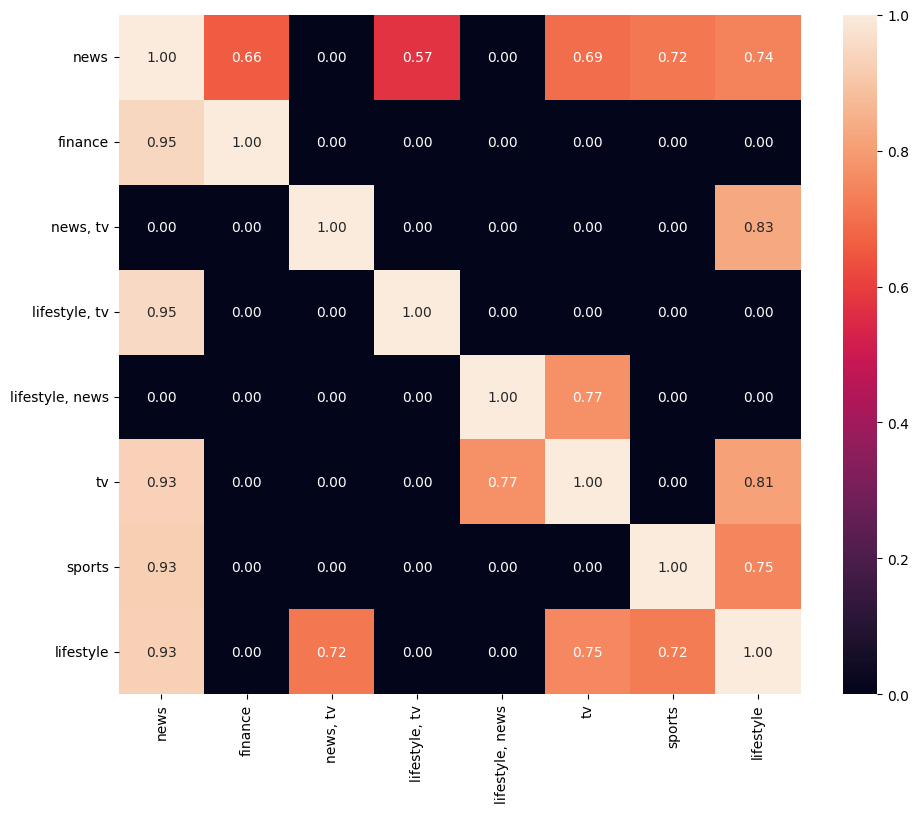
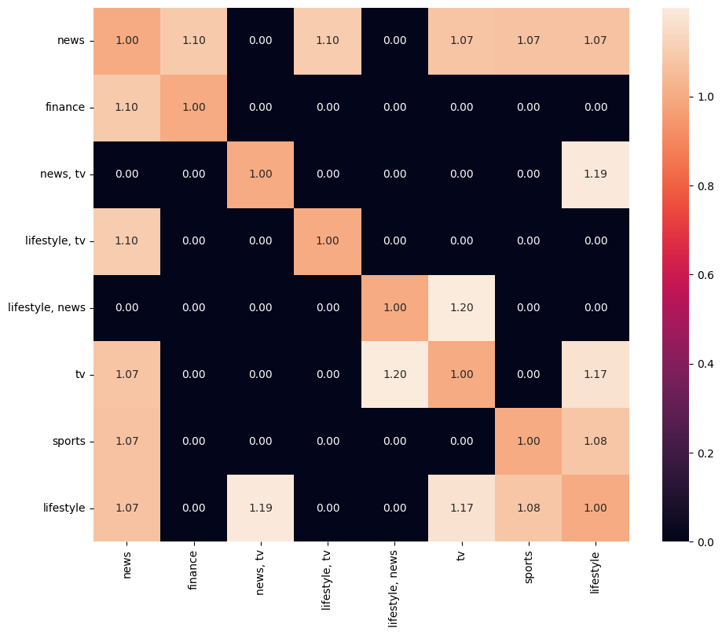
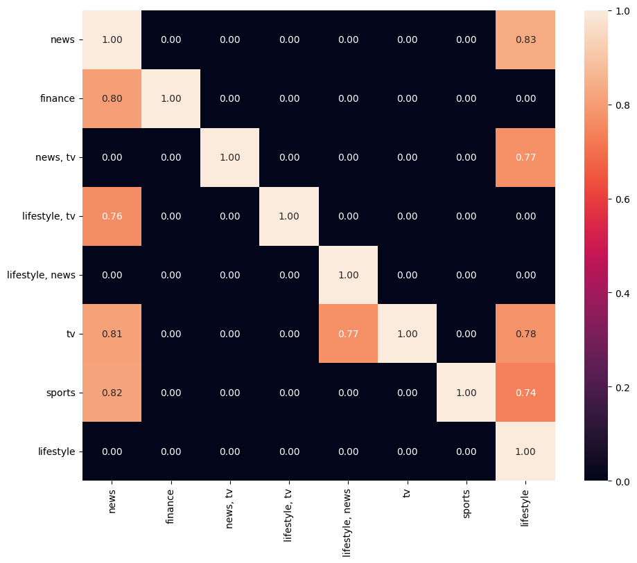

# 数据挖掘互评作业二: 频繁模式与关联规则挖掘
1. 问题描述
本次作业中，将选择2个数据集进行分析与挖掘


2. 可选数据集
来源包括：
SNAP(Stanford Large Network Dataset Collection): http://snap.stanford.edu/data/index.html
Microsoft 资讯推荐:  https://learn.microsoft.com/zh-cn/azure/open-datasets/dataset-microsoft-news?tabs=azureml-opendatasets
YELP: https://www.yelp.com/dataset/download
DBLP: https://dblp.uni-trier.de/xml/

3. 数据分析要求
数据获取与预处理；
频繁模式挖掘：可以是项集、序列和图。
模式命名：如论文-作者网络中合作模式、引用模式和发表模式等，不同的领域的频繁模式的含义也不尽相同，需自行确定模式的名称。
对挖掘结果进行分析；
可视化展示。

4. 提交的内容
数据集获取和预处理的代码
关联规则挖掘的代码
挖掘过程的报告：展示挖掘的过程、结果和你的分析
所选择的数据集在README中说明，数据文件不要上传到Github中

# 一、针对Microsoft资讯推荐数据集的处理

## 1、数据获取与预处理

### 数据获取
运行 https://learn.microsoft.com/zh-cn/azure/open-datasets/dataset-microsoft-news?tabs=azureml-opendatasets 给出的数据获取代码


```python
import os
import tempfile
import shutil
import urllib
import zipfile
import pandas as pd

# Temporary folder for data we need during execution of this notebook (we'll clean up
# at the end, we promise)
temp_dir = os.path.join(tempfile.gettempdir(), 'mind')
os.makedirs(temp_dir, exist_ok=True)

# The dataset is split into training and validation set, each with a large and small version.
# The format of the four files are the same.
# For demonstration purpose, we will use small version validation set only.
base_url = 'https://mind201910small.blob.core.windows.net/release'
training_small_url = f'{base_url}/MINDsmall_train.zip'
validation_small_url = f'{base_url}/MINDsmall_dev.zip'
training_large_url = f'{base_url}/MINDlarge_train.zip'
validation_large_url = f'{base_url}/MINDlarge_dev.zip'
```


```python
def download_url(url,
                 destination_filename=None,
                 progress_updater=None,
                 force_download=False,
                 verbose=True):
    """
    Download a URL to a temporary file
    """
    if not verbose:
        progress_updater = None
    # This is not intended to guarantee uniqueness, we just know it happens to guarantee
    # uniqueness for this application.
    if destination_filename is None:
        url_as_filename = url.replace('://', '_').replace('/', '_')
        destination_filename = \
            os.path.join(temp_dir,url_as_filename)
    if (not force_download) and (os.path.isfile(destination_filename)):
        if verbose:
            print('Bypassing download of already-downloaded file {}'.format(
                os.path.basename(url)))
        return destination_filename
    if verbose:
        print('Downloading file {} to {}'.format(os.path.basename(url),
                                                 destination_filename),
              end='')
    urllib.request.urlretrieve(url, destination_filename, progress_updater)
    assert (os.path.isfile(destination_filename))
    nBytes = os.path.getsize(destination_filename)
    if verbose:
        print('...done, {} bytes.'.format(nBytes))
    return destination_filename
```


```python
# For demonstration purpose, we will use small version validation set only.
# This file is about 30MB.
zip_path = download_url(validation_small_url, verbose=True)
with zipfile.ZipFile(zip_path, 'r') as zip_ref:
    zip_ref.extractall(temp_dir)

os.listdir(temp_dir)
```

    Bypassing download of already-downloaded file MINDsmall_dev.zip


    ['behaviors.tsv',
     'entity_embedding.vec',
     'https_mind201910small.blob.core.windows.net_release_MINDsmall_dev.zip',
     'news.tsv',
     'relation_embedding.vec']


```python
# The behaviors.tsv file contains the impression logs and users' news click histories. 
# It has 5 columns divided by the tab symbol:
# - Impression ID. The ID of an impression.
# - User ID. The anonymous ID of a user.
# - Time. The impression time with format "MM/DD/YYYY HH:MM:SS AM/PM".
# - History. The news click history (ID list of clicked news) of this user before this impression.
# - Impressions. List of news displayed in this impression and user's click behaviors on them (1 for click and 0 for non-click).
behaviors_path = os.path.join(temp_dir, 'behaviors.tsv')
behaviors_table = pd.read_table(
    behaviors_path,
    header=None,
    names=['impression_id', 'user_id', 'time', 'history', 'impressions'])
behaviors_table
```


<div>
<style scoped>
    .dataframe tbody tr th:only-of-type {
        vertical-align: middle;
    }

    .dataframe tbody tr th {
        vertical-align: top;
    }
    
    .dataframe thead th {
        text-align: right;
    }
</style>
<table border="1" class="dataframe">
  <thead>
    <tr style="text-align: right;">
      <th></th>
      <th>impression_id</th>
      <th>user_id</th>
      <th>time</th>
      <th>history</th>
      <th>impressions</th>
    </tr>
  </thead>
  <tbody>
    <tr>
      <th>0</th>
      <td>1</td>
      <td>U80234</td>
      <td>11/15/2019 12:37:50 PM</td>
      <td>N55189 N46039 N51741 N53234 N11276 N264 N40716...</td>
      <td>N28682-0 N48740-0 N31958-1 N34130-0 N6916-0 N5...</td>
    </tr>
    <tr>
      <th>1</th>
      <td>2</td>
      <td>U60458</td>
      <td>11/15/2019 7:11:50 AM</td>
      <td>N58715 N32109 N51180 N33438 N54827 N28488 N611...</td>
      <td>N20036-0 N23513-1 N32536-0 N46976-0 N35216-0 N...</td>
    </tr>
    <tr>
      <th>2</th>
      <td>3</td>
      <td>U44190</td>
      <td>11/15/2019 9:55:12 AM</td>
      <td>N56253 N1150 N55189 N16233 N61704 N51706 N5303...</td>
      <td>N36779-0 N62365-0 N58098-0 N5472-0 N13408-0 N5...</td>
    </tr>
    <tr>
      <th>3</th>
      <td>4</td>
      <td>U87380</td>
      <td>11/15/2019 3:12:46 PM</td>
      <td>N63554 N49153 N28678 N23232 N43369 N58518 N444...</td>
      <td>N6950-0 N60215-0 N6074-0 N11930-0 N6916-0 N248...</td>
    </tr>
    <tr>
      <th>4</th>
      <td>5</td>
      <td>U9444</td>
      <td>11/15/2019 8:25:46 AM</td>
      <td>N51692 N18285 N26015 N22679 N55556</td>
      <td>N5940-1 N23513-0 N49285-0 N23355-0 N19990-0 N3...</td>
    </tr>
    <tr>
      <th>...</th>
      <td>...</td>
      <td>...</td>
      <td>...</td>
      <td>...</td>
      <td>...</td>
    </tr>
    <tr>
      <th>73147</th>
      <td>73148</td>
      <td>U77536</td>
      <td>11/15/2019 8:40:16 PM</td>
      <td>N28691 N8845 N58434 N37120 N22185 N60033 N4702...</td>
      <td>N496-0 N35159-0 N59856-0 N13270-0 N47213-0 N26...</td>
    </tr>
    <tr>
      <th>73148</th>
      <td>73149</td>
      <td>U56193</td>
      <td>11/15/2019 1:11:26 PM</td>
      <td>N4705 N58782 N53531 N46492 N26026 N28088 N3109...</td>
      <td>N49285-0 N31958-0 N55237-0 N42844-0 N29862-0 N...</td>
    </tr>
    <tr>
      <th>73149</th>
      <td>73150</td>
      <td>U16799</td>
      <td>11/15/2019 3:37:06 PM</td>
      <td>N40826 N42078 N15670 N15295 N64536 N46845 N52294</td>
      <td>N7043-0 N512-0 N60215-1 N45057-0 N496-0 N37055...</td>
    </tr>
    <tr>
      <th>73150</th>
      <td>73151</td>
      <td>U8786</td>
      <td>11/15/2019 8:29:26 AM</td>
      <td>N3046 N356 N20483 N46107 N44598 N18693 N8254 N...</td>
      <td>N23692-0 N19990-0 N20187-0 N5940-0 N13408-0 N3...</td>
    </tr>
    <tr>
      <th>73151</th>
      <td>73152</td>
      <td>U68182</td>
      <td>11/15/2019 11:54:34 AM</td>
      <td>N20297 N53568 N4690 N60608 N43709 N43123 N1885...</td>
      <td>N29862-0 N5472-0 N21679-1 N6400-0 N53572-0 N50...</td>
    </tr>
  </tbody>
</table>
<p>73152 rows × 5 columns</p>
</div>


```python
# The news.tsv file contains the detailed information of news articles involved in the behaviors.tsv file.
# It has 7 columns, which are divided by the tab symbol:
# - News ID
# - Category
# - Subcategory
# - Title
# - Abstract
# - URL
# - Title Entities (entities contained in the title of this news)
# - Abstract Entities (entities contained in the abstract of this news)
news_path = os.path.join(temp_dir, 'news.tsv')
news_table = pd.read_table(news_path,
              header=None,
              names=[
                  'id', 'category', 'subcategory', 'title', 'abstract', 'url',
                  'title_entities', 'abstract_entities'
              ])
news_table
```


<div>
<style scoped>
    .dataframe tbody tr th:only-of-type {
        vertical-align: middle;
    }

    .dataframe tbody tr th {
        vertical-align: top;
    }
    
    .dataframe thead th {
        text-align: right;
    }
</style>
<table border="1" class="dataframe">
  <thead>
    <tr style="text-align: right;">
      <th></th>
      <th>id</th>
      <th>category</th>
      <th>subcategory</th>
      <th>title</th>
      <th>abstract</th>
      <th>url</th>
      <th>title_entities</th>
      <th>abstract_entities</th>
    </tr>
  </thead>
  <tbody>
    <tr>
      <th>0</th>
      <td>N55528</td>
      <td>lifestyle</td>
      <td>lifestyleroyals</td>
      <td>The Brands Queen Elizabeth, Prince Charles, an...</td>
      <td>Shop the notebooks, jackets, and more that the...</td>
      <td>https://assets.msn.com/labs/mind/AAGH0ET.html</td>
      <td>[{"Label": "Prince Philip, Duke of Edinburgh",...</td>
      <td>[]</td>
    </tr>
    <tr>
      <th>1</th>
      <td>N18955</td>
      <td>health</td>
      <td>medical</td>
      <td>Dispose of unwanted prescription drugs during ...</td>
      <td>NaN</td>
      <td>https://assets.msn.com/labs/mind/AAISxPN.html</td>
      <td>[{"Label": "Drug Enforcement Administration", ...</td>
      <td>[]</td>
    </tr>
    <tr>
      <th>2</th>
      <td>N61837</td>
      <td>news</td>
      <td>newsworld</td>
      <td>The Cost of Trump's Aid Freeze in the Trenches...</td>
      <td>Lt. Ivan Molchanets peeked over a parapet of s...</td>
      <td>https://assets.msn.com/labs/mind/AAJgNsz.html</td>
      <td>[]</td>
      <td>[{"Label": "Ukraine", "Type": "G", "WikidataId...</td>
    </tr>
    <tr>
      <th>3</th>
      <td>N53526</td>
      <td>health</td>
      <td>voices</td>
      <td>I Was An NBA Wife. Here's How It Affected My M...</td>
      <td>I felt like I was a fraud, and being an NBA wi...</td>
      <td>https://assets.msn.com/labs/mind/AACk2N6.html</td>
      <td>[]</td>
      <td>[{"Label": "National Basketball Association", ...</td>
    </tr>
    <tr>
      <th>4</th>
      <td>N38324</td>
      <td>health</td>
      <td>medical</td>
      <td>How to Get Rid of Skin Tags, According to a De...</td>
      <td>They seem harmless, but there's a very good re...</td>
      <td>https://assets.msn.com/labs/mind/AAAKEkt.html</td>
      <td>[{"Label": "Skin tag", "Type": "C", "WikidataI...</td>
      <td>[{"Label": "Skin tag", "Type": "C", "WikidataI...</td>
    </tr>
    <tr>
      <th>...</th>
      <td>...</td>
      <td>...</td>
      <td>...</td>
      <td>...</td>
      <td>...</td>
      <td>...</td>
      <td>...</td>
      <td>...</td>
    </tr>
    <tr>
      <th>42411</th>
      <td>N63550</td>
      <td>lifestyle</td>
      <td>lifestyleroyals</td>
      <td>Why Kate &amp; Meghan Were on Different Balconies ...</td>
      <td>There's no scandal here. It's all about the or...</td>
      <td>https://assets.msn.com/labs/mind/BBWyynu.html</td>
      <td>[{"Label": "Meghan, Duchess of Sussex", "Type"...</td>
      <td>[]</td>
    </tr>
    <tr>
      <th>42412</th>
      <td>N30345</td>
      <td>entertainment</td>
      <td>entertainment-celebrity</td>
      <td>See the stars at the 2019 Baby2Baby gala</td>
      <td>Stars like Chrissy Teigen and Kate Hudson supp...</td>
      <td>https://assets.msn.com/labs/mind/BBWyz7N.html</td>
      <td>[]</td>
      <td>[{"Label": "Kate Hudson", "Type": "P", "Wikida...</td>
    </tr>
    <tr>
      <th>42413</th>
      <td>N30135</td>
      <td>news</td>
      <td>newsgoodnews</td>
      <td>Tennessee judge holds lawyer's baby as he swea...</td>
      <td>Tennessee Court of Appeals Judge Richard Dinki...</td>
      <td>https://assets.msn.com/labs/mind/BBWyzI8.html</td>
      <td>[{"Label": "Tennessee", "Type": "G", "Wikidata...</td>
      <td>[{"Label": "Tennessee Court of Appeals", "Type...</td>
    </tr>
    <tr>
      <th>42414</th>
      <td>N44276</td>
      <td>autos</td>
      <td>autossports</td>
      <td>Best Sports Car Deals for October</td>
      <td>NaN</td>
      <td>https://assets.msn.com/labs/mind/BBy5rVe.html</td>
      <td>[{"Label": "Peugeot RCZ", "Type": "V", "Wikida...</td>
      <td>[]</td>
    </tr>
    <tr>
      <th>42415</th>
      <td>N39563</td>
      <td>sports</td>
      <td>more_sports</td>
      <td>Shall we dance: Sports stars shake their leg</td>
      <td>NaN</td>
      <td>https://assets.msn.com/labs/mind/BBzMpnG.html</td>
      <td>[]</td>
      <td>[]</td>
    </tr>
  </tbody>
</table>
<p>42416 rows × 8 columns</p>
</div>


```python
# The entity_embedding.vec file contains the 100-dimensional embeddings
# of the entities learned from the subgraph by TransE method.
# The first column is the ID of entity, and the other columns are the embedding vector values.
entity_embedding_path = os.path.join(temp_dir, 'entity_embedding.vec')
entity_embedding = pd.read_table(entity_embedding_path, header=None)
entity_embedding['vector'] = entity_embedding.iloc[:, 1:101].values.tolist()
entity_embedding = entity_embedding[[0,
                                     'vector']].rename(columns={0: "entity"})
entity_embedding
```


<div>
<style scoped>
    .dataframe tbody tr th:only-of-type {
        vertical-align: middle;
    }

    .dataframe tbody tr th {
        vertical-align: top;
    }
    
    .dataframe thead th {
        text-align: right;
    }
</style>
<table border="1" class="dataframe">
  <thead>
    <tr style="text-align: right;">
      <th></th>
      <th>entity</th>
      <th>vector</th>
    </tr>
  </thead>
  <tbody>
    <tr>
      <th>0</th>
      <td>Q34433</td>
      <td>[0.017808, -0.073256, 0.102521, -0.059926, -0....</td>
    </tr>
    <tr>
      <th>1</th>
      <td>Q41</td>
      <td>[-0.063388, -0.181451, 0.057501, -0.091254, -0...</td>
    </tr>
    <tr>
      <th>2</th>
      <td>Q56037</td>
      <td>[0.02155, -0.044888, -0.027872, -0.128843, 0.0...</td>
    </tr>
    <tr>
      <th>3</th>
      <td>Q1860</td>
      <td>[0.060958, 0.069934, 0.015832, 0.079471, -0.02...</td>
    </tr>
    <tr>
      <th>4</th>
      <td>Q39631</td>
      <td>[-0.093106, -0.052002, 0.020556, -0.020801, 0....</td>
    </tr>
    <tr>
      <th>...</th>
      <td>...</td>
      <td>...</td>
    </tr>
    <tr>
      <th>22888</th>
      <td>Q278846</td>
      <td>[0.042413, 0.021957, 0.072414, -0.068437, 0.02...</td>
    </tr>
    <tr>
      <th>22889</th>
      <td>Q54621949</td>
      <td>[-0.018299, -0.048378, -0.021645, -0.079743, 0...</td>
    </tr>
    <tr>
      <th>22890</th>
      <td>Q42225228</td>
      <td>[-0.051346, -0.028947, -0.07587, 0.017512, -0....</td>
    </tr>
    <tr>
      <th>22891</th>
      <td>Q54862508</td>
      <td>[-0.052323, -0.078029, -0.060925, -0.052536, 0...</td>
    </tr>
    <tr>
      <th>22892</th>
      <td>Q42301562</td>
      <td>[-0.00519, -0.047871, 0.009753, -0.0215, -4.9e...</td>
    </tr>
  </tbody>
</table>
<p>22893 rows × 2 columns</p>
</div>


```python
# The relation_embedding.vec file contains the 100-dimensional embeddings
# of the relations learned from the subgraph by TransE method.
# The first column is the ID of relation, and the other columns are the embedding vector values.
relation_embedding_path = os.path.join(temp_dir, 'relation_embedding.vec')
relation_embedding = pd.read_table(relation_embedding_path, header=None)
relation_embedding['vector'] = relation_embedding.iloc[:,
                                                       1:101].values.tolist()
relation_embedding = relation_embedding[[0, 'vector'
                                         ]].rename(columns={0: "relation"})
relation_embedding
```


<div>
<style scoped>
    .dataframe tbody tr th:only-of-type {
        vertical-align: middle;
    }

    .dataframe tbody tr th {
        vertical-align: top;
    }
    
    .dataframe thead th {
        text-align: right;
    }
</style>
<table border="1" class="dataframe">
  <thead>
    <tr style="text-align: right;">
      <th></th>
      <th>relation</th>
      <th>vector</th>
    </tr>
  </thead>
  <tbody>
    <tr>
      <th>0</th>
      <td>P31</td>
      <td>[-0.073467, -0.132227, 0.034173, -0.032769, 0....</td>
    </tr>
    <tr>
      <th>1</th>
      <td>P21</td>
      <td>[-0.078436, 0.108589, -0.049429, -0.131355, 0....</td>
    </tr>
    <tr>
      <th>2</th>
      <td>P106</td>
      <td>[-0.052137, 0.052444, -0.019886, -0.152309, 0....</td>
    </tr>
    <tr>
      <th>3</th>
      <td>P735</td>
      <td>[-0.051398, 0.056219, 0.068029, -0.137717, -0....</td>
    </tr>
    <tr>
      <th>4</th>
      <td>P108</td>
      <td>[0.091231, 0.022526, 0.059349, -0.141853, 0.03...</td>
    </tr>
    <tr>
      <th>...</th>
      <td>...</td>
      <td>...</td>
    </tr>
    <tr>
      <th>1086</th>
      <td>P1897</td>
      <td>[-0.019021, 0.001183, -0.009602, -0.040833, -0...</td>
    </tr>
    <tr>
      <th>1087</th>
      <td>P3776</td>
      <td>[-0.018365, 0.028526, -0.025934, 0.032296, -0....</td>
    </tr>
    <tr>
      <th>1088</th>
      <td>P1194</td>
      <td>[-0.026819, 0.003231, -0.011298, -0.015206, 0....</td>
    </tr>
    <tr>
      <th>1089</th>
      <td>P2502</td>
      <td>[0.003554, -0.041121, -0.010559, -0.037862, -0...</td>
    </tr>
    <tr>
      <th>1090</th>
      <td>P6977</td>
      <td>[-0.023617, -0.021648, 0.009369, -0.021757, 0....</td>
    </tr>
  </tbody>
</table>
<p>1091 rows × 2 columns</p>
</div>


### 数据预处理
将behaviors_table中的history按news_table中的类型替换为整数格式


```python
behaviors_table = behaviors_table.dropna()
transaction = []
category = news_table['category'].unique().tolist()
print(category)
err_num = 0
for i in range(len(behaviors_table)):
    try:
        news_list = behaviors_table['history'][i].split(' ')
        tmp_list = []
        for news_id in news_list:
            tmp_list.append(category.index(news_table['category'][news_table[news_table.id == news_id].index.tolist()[0]]))
        transaction.append(tmp_list)
    except:
        err_num += 1
print('error count: ', err_num)
print(transaction[0:10])
```

    ['lifestyle', 'health', 'news', 'sports', 'weather', 'entertainment', 'foodanddrink', 'autos', 'travel', 'video', 'tv', 'finance', 'movies', 'music', 'kids', 'middleeast', 'games']
    error count:  2150
    [[10, 2, 10, 2, 11, 7, 10, 12, 5, 2, 0, 2, 2, 1, 10], [2, 8, 11, 2, 2, 11, 13, 2, 11, 4, 11, 1, 0], [3, 2, 10, 2, 0, 3, 2, 5, 3], [8, 2, 3, 3, 8, 2, 10, 2, 3, 2, 10, 2, 12, 8, 9, 2, 3, 3, 2], [10, 3, 5, 3, 11], [3, 11, 3, 2, 2, 11, 6, 5, 3, 11, 7], [10, 10, 2, 6, 11, 2, 11, 0, 6], [2, 3, 2, 2, 3, 3, 3, 2, 3, 2], [2, 3, 2, 2, 2, 2, 5, 2, 2], [2, 3, 11, 2, 2, 2, 2, 2, 1, 12]]


## 2、频繁模式与关联规则挖掘

使用orangecontrib.associate.fpgrowth包进行频繁模式挖掘。首先使用默认的0.2作为频繁模式的相对支持度支持度阈值。


```python
import orangecontrib.associate.fpgrowth as oaf

items = list(oaf.frequent_itemsets(transaction, 0.5))
for i in items:
    print(i)
```

    (frozenset({0}), 49167)
    (frozenset({2}), 61406)
    (frozenset({0, 2}), 45533)
    (frozenset({3}), 47444)
    (frozenset({0, 3}), 35535)
    (frozenset({2, 3}), 43907)
    (frozenset({10}), 45719)
    (frozenset({0, 10}), 36972)
    (frozenset({2, 10}), 42526)
    (frozenset({0, 2, 10}), 35192)
    (frozenset({11}), 42614)
    (frozenset({2, 11}), 40412)


frozenset是项集，后面的数字是这个项集的绝对支持度。为了更好地显示频繁项集，下面将数字重新转化为原始的字符串，同时计算相对支持度。


```python
for i in items:
    freq_set = []
    abs_sup = i[1]
    for j in i[0]:
        freq_set.append(category[j])
    print(freq_set, abs_sup, round(float(abs_sup) / len(behaviors_table), 2))
```

    ['lifestyle'] 49167 0.69
    ['news'] 61406 0.87
    ['lifestyle', 'news'] 45533 0.64
    ['sports'] 47444 0.67
    ['lifestyle', 'sports'] 35535 0.5
    ['news', 'sports'] 43907 0.62
    ['tv'] 45719 0.64
    ['lifestyle', 'tv'] 36972 0.52
    ['news', 'tv'] 42526 0.6
    ['lifestyle', 'news', 'tv'] 35192 0.5
    ['finance'] 42614 0.6
    ['news', 'finance'] 40412 0.57


在计算出频繁项集的基础上，计算关联规则，置信度阈值选择为0.5，结果转化为原始字符串输出.


```python
items = list(oaf.frequent_itemsets(transaction, 0.5))
rules = list(oaf.association_rules(dict(items), 0.5))
for i in rules:
    antecedent = []
    consequent = []
    for j in i[0]:
        antecedent.append(category[j])
    for j in i[1]:
        consequent.append(category[j])
    print(antecedent, "->", consequent, i[2], round(i[3],2))
print(len(rules))
```

    ['news', 'tv'] -> ['lifestyle'] 35192 0.83
    ['lifestyle', 'tv'] -> ['news'] 35192 0.95
    ['tv'] -> ['lifestyle', 'news'] 35192 0.77
    ['lifestyle', 'news'] -> ['tv'] 35192 0.77
    ['news'] -> ['lifestyle', 'tv'] 35192 0.57
    ['lifestyle'] -> ['tv', 'news'] 35192 0.72
    ['news'] -> ['lifestyle'] 45533 0.74
    ['lifestyle'] -> ['news'] 45533 0.93
    ['sports'] -> ['lifestyle'] 35535 0.75
    ['lifestyle'] -> ['sports'] 35535 0.72
    ['sports'] -> ['news'] 43907 0.93
    ['news'] -> ['sports'] 43907 0.72
    ['tv'] -> ['lifestyle'] 36972 0.81
    ['lifestyle'] -> ['tv'] 36972 0.75
    ['tv'] -> ['news'] 42526 0.93
    ['news'] -> ['tv'] 42526 0.69
    ['finance'] -> ['news'] 40412 0.95
    ['news'] -> ['finance'] 40412 0.66
    18


## 3.关联规则的评价

使用Lift和Kulc两种评价指标评价关联规则。


```python
measure = list(oaf.rules_stats(oaf.association_rules(dict(items), 0.5), dict(oaf.frequent_itemsets(transaction, 0.5)), len(behaviors_table)))
for i in measure:
    antecedent = []
    consequent = []
    for j in i[0]:
        antecedent.append(category[j])
    for j in i[1]:
        consequent.append(category[j])
    print(antecedent, "->", consequent, round(i[6], 2))
```

    ['news', 'tv'] -> ['lifestyle'] 1.19
    ['lifestyle', 'tv'] -> ['news'] 1.1
    ['tv'] -> ['lifestyle', 'news'] 1.2
    ['lifestyle', 'news'] -> ['tv'] 1.2
    ['news'] -> ['lifestyle', 'tv'] 1.1
    ['lifestyle'] -> ['tv', 'news'] 1.19
    ['news'] -> ['lifestyle'] 1.07
    ['lifestyle'] -> ['news'] 1.07
    ['sports'] -> ['lifestyle'] 1.08
    ['lifestyle'] -> ['sports'] 1.08
    ['sports'] -> ['news'] 1.07
    ['news'] -> ['sports'] 1.07
    ['tv'] -> ['lifestyle'] 1.17
    ['lifestyle'] -> ['tv'] 1.17
    ['tv'] -> ['news'] 1.07
    ['news'] -> ['tv'] 1.07
    ['finance'] -> ['news'] 1.1
    ['news'] -> ['finance'] 1.1


```python
# 计算Kulc
kulc = []
visit = [False for i in range(len(rules))]
for i in range(len(rules)):
    if visit[i] == True:
        continue
    visit[i] = True
    for j in range(len(rules)):
        if visit[j] == True:
            continue
        if rules[j][0] == rules[i][1] and rules[j][1] == rules[i][0]:
            one = []
            antecedent = []
            consequent = []
            for k in rules[i][0]:
                antecedent.append(category[k])
            for k in rules[i][1]:
                consequent.append(category[k])
            one.append(rules[i][0])
            one.append(rules[i][1])
            one.append((rules[i][3] + rules[j][3])/2)
            kulc.append(one)
            print('Kulc(', antecedent, consequent, ') = ', round((rules[i][3] + rules[j][3])/2, 2))
            visit[j] = True
```

    Kulc( ['news', 'tv'] ['lifestyle'] ) =  0.77
    Kulc( ['lifestyle', 'tv'] ['news'] ) =  0.76
    Kulc( ['tv'] ['lifestyle', 'news'] ) =  0.77
    Kulc( ['news'] ['lifestyle'] ) =  0.83
    Kulc( ['sports'] ['lifestyle'] ) =  0.74
    Kulc( ['sports'] ['news'] ) =  0.82
    Kulc( ['tv'] ['lifestyle'] ) =  0.78
    Kulc( ['tv'] ['news'] ) =  0.81
    Kulc( ['finance'] ['news'] ) =  0.8


## 4.挖掘结果的分析

lift可以用于衡量关联规则中两个项目的相关度，
lift(A,B)>1说明A与B正相关，
lift(A,B)=1说明A与B相互独立，
lift(A,B)<1说明A与B负相关。所有的18条关联规则中，lift值均大于1。

在所有计算出的关联规则的Kulc值中，以下三个Kulc值较大：

Kulc( ['news'] ['lifestyle'] ) =  0.83

Kulc( ['sports'] ['news'] ) =  0.82

Kulc( ['tv'] ['news'] ) =  0.81

因此可以得到以下结论：

1、对新闻相关内容感兴趣的观众对生活方式相关内容同样感兴趣

2、对体育相关内容感兴趣的观众对新闻相关内容同样感兴趣

3、对电视节目相关内容感兴趣的观众对新闻相关内容同样感兴趣

在关联规则中，有两条的置信度很高：

['lifestyle', 'tv'] -> ['news'] 35192 0.95

['finance'] -> ['news'] 40412 0.95

## 5.可视化展示

绘制关联规则的置信度、Lift和Kulc相关性热图

横纵坐标是关联规则中包含的项，热图中每个点的数据是两项的置信度、Lift值或Kulc值


```python
import matplotlib.pyplot as plt
import seaborn as sns
# 利用置信度绘制热图
conf_matrix = []
rules_column = set()

for i in range(len(measure)):
    rules_column.add(measure[i][0])
# 计算置信度矩阵
for i in rules_column:
    one = []
    for j in rules_column:
        if i == j:
            one.append(1)
        else:
            flag = False
            for k in range(len(rules)):
                if rules[k][0] == i and rules[k][1] == j:
                    one.append(rules[k][3])
                    flag = True
            if flag == False:
                one.append(0)
    conf_matrix.append(one)
# 改columns名字
rules_column_list = []
for i in rules_column:
    one = ""
    for j in range(len(i)):
        one += category[j]
        if j < len(i) - 1:
            one += ", "
    rules_column_list.append(one)
# 绘制热图的数据
rules_column = list(rules_column)
rules_column_list = []
for i in rules_column:
    one = ""
    for j in range(len(i)):
        one += category[list(i)[j]]
        if j < len(i) - 1:
            one += ", "
    rules_column_list.append(one)

conf_pd = pd.DataFrame(conf_matrix, columns = rules_column_list, index = rules_column_list)
plt.figure(figsize=(11, 9),dpi=100)
sns.heatmap(data = conf_pd, annot = True, fmt = ".2f")
plt.show()
```


​    

​    


```python
# 使用Lift值绘制热图
# 计算lift矩阵
lift_matrix = []
for i in rules_column:
    one = []
    for j in rules_column:
        if i == j:
            one.append(1)
        else:
            flag = False
            for k in range(len(measure)):
                if measure[k][0] == i and measure[k][1] == j:
                    one.append(measure[k][6])
                    flag = True
            if flag == False:
                one.append(0)
    lift_matrix.append(one)

lift_pd = pd.DataFrame(lift_matrix, columns = rules_column_list, index = rules_column_list)
plt.figure(figsize=(11, 9),dpi=100)
sns.heatmap(data = lift_pd, annot = True, fmt = ".2f")
plt.show()
```


​    

​    


```python
# 使用Kulc值绘制热图
kulc_matrix = []
# 计算kulc矩阵
for i in rules_column:
    one = []
    for j in rules_column:
        if i == j:
            one.append(1)
        else:
            flag = False
            for k in range(len(kulc)):
                if kulc[k][0] == i and kulc[k][1] == j:
                    one.append(kulc[k][2])
                    flag = True
            if flag == False:
                one.append(0)
    kulc_matrix.append(one)
    
kulc_pd = pd.DataFrame(kulc_matrix, columns = rules_column_list, index = rules_column_list)
plt.figure(figsize=(11, 9),dpi=100)
sns.heatmap(data = kulc_pd, annot = True, fmt = ".2f")
plt.show()
```


​    

​    


```python

```


```python

```


```python

```


```python

```


```python

```
